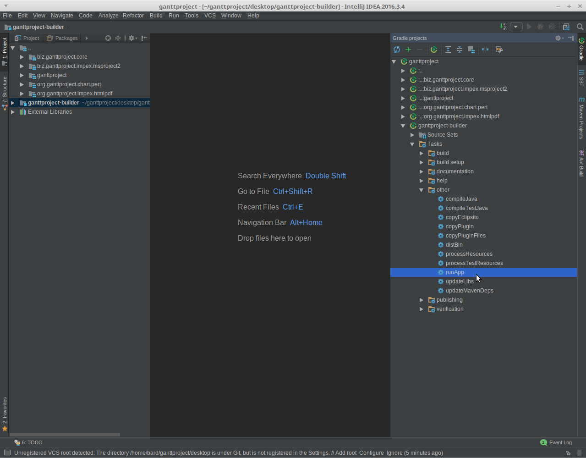

# &Uuml;bung 1 Ganttproject:  Setup der Umgebung

## Administratives

*Abgabe:* Bearbeiten bis 27. September 2017. Abgabe zusammen mit n&auml;chster &Uuml;bung bis 3. Oktober 2017 via Pullrequest
 auf Github. Details finden Sie auf dem n&auml;chsten &Uuml;bungsblatt.

## Einf&uuml;hrung

F&uuml;r die meisten &Uuml;bungen in diesem Kurs werden wir das Open Source Projekt [Ganttproject](http://www.ganttproject.biz/) verwenden. 
In dieser ersten &Uuml;bung werden Sie die Umgebung (Werkzeuge, Entwicklungsumgebung) aufsetzten, damit sie im folgenden &Auml;nderungen und Erweiterungen im Code vornehmen k&ouml;nnen. 

## Vorbereitung

Falls sie noch keinen Benutzeraccount auf [Github](https://www.github.com) haben, erstellen sie bitte einen. Teilen sie mir Ihren Benutzernamen via Mail mait(marcel.luethi@unibas.ch), damit wir Ihnen Zugriff auf das Code-Repository geben k&ouml;nnen.  

## Installation der Werkzeuge

### Git 

Installieren sie das Versionsverwaltungswerkzeug [Git](https://git-scm.com/). Informationen zu Download und Installation finden sie auf der Git [Homepage](https://git-scm.com/).

#### Test der Installation

&Ouml;ffnen sie eine Konsole. Eingabe von
``` 
git --version 
```
sollte die Version von Git ausgeben, also z.B.
```
> git version 1.9.5.msysgit.1
```

### Gradle

Installieren sie das Buildsystem [Gradle](https://gradle.org/). Informationen zu Download und Installation finden sie auf der Gradle [Homepage](https://gradle.org/).


#### Test der Installation

&Ouml;ffnen sie eine Konsole. Eingabe von
``` 
gradle --version 
```
sollte die Version von Grade ausgeben, also z.B.
```
-----------------------------------
Gradle 3.5
-----------------------------------
...
...
```

### IntelliJ Idea

Installieren sie die Entwicklungsumgebung [IntelliJ IDEA](https://www.jetbrains.com/idea/). Informationen zu Download und Installation finden sie auf der [Homepage](https://www.jetbrains.com/idea/). 

*Bemerkung:* Wir arbeiten in diesem Kurs mit der *Community Edition*.

#### Test der Installation

Sie k&ouml;nnen die Entwicklungsumgebung starten (eine grafische Oberfl&auml;che sollte erscheinen).

### Fork von Ganttproject

Dieser Schritt setzt voraus, dass wir Ihnen bereits Zugriff auf unser privates Repository von ganttproject gegeben haben. Sie k&ouml;nnen dies &Uuml;berpr&uuml;fen indem sie auf [https://github.com/unibas-sweng/ganttproject](https://github.com/unibas-sweng/ganttproject) gehen. 
Falls sie bereits Zugriff haben, sollte die Seite wie folgt aussehen:


Sie k&ouml;nnen das Projekt forken indem sie oben rechts auf den "Fork" Button klicken.    Nach erfolgreichem Fork landen sie nun auf ihrer pers&ouml;nlichen Kopie des Projekts, auf der sie von nun an arbeiten werden. 

### Klonen des Projekts

Damit sie an dem Projekt arbeite k&ouml;nnen m&uuml;ssen sie das Repository noch auf Ihren eigenen Computer bringen (d.h. das Repository "klonen"). Dr&uuml;cken sie den gr&uuml;nen Button "Clone or Download" und kopieren sie die URL.
 
&Ouml;ffnen sie eine Konsole, welchseln sie in ihr gew&uuml;nschtes Arbeitsverzeichnis und geben sie folgendes ein:

```
git clone THE_URL_FOR_YOUR_PROJECT ganttproject
```

### Kompilieren des Projekts von der Kommandozeile

Bevor wir das Projekt in der IDE bearbeiten, 

```
cd ganttproject
cd ganttproject-builder
```

```
gradle updateLibs
gradle distBin
```

Starten

```
gradle runApp
```

### Bearbeiten des Projekts in der IDE

Wir werden in diesem Kurs haupts&auml;chlich von der IDE arbeiten. Um das Projekt in Idea zu &ouml;ffnen, m&uuml;ssen die gradle build Definition &ouml;ffnen 
```
ganttproject\ganttproject-builder\build.gradle
```
Die Datei &ouml;ffnen sie mittels ```File->Open``` oder dem ```Open``` Button auf der Startscreen von Idea.


W&auml;hlen sie nun "Open as project". Sie sollten nun mit dem Projekt arbeiten k&ouml;nnen. Um das Projekt zu kompilieren, w&auml;hlen sie ```Build->Build Project```. 

Um das Projekt zu starten, &ouml;ffnen sie die GradleView (Taskleiste rechts) und w&auml;hlen sie die Task RunApp (siehe Screenshot):




Herzliche Gratulation! Sie sind nun in der Lage das Projekt nach ihren W&uuml;nschen zu ver&auml;ndern. Mehr dazu in der n&auml;chsten &Uuml;bung. 


