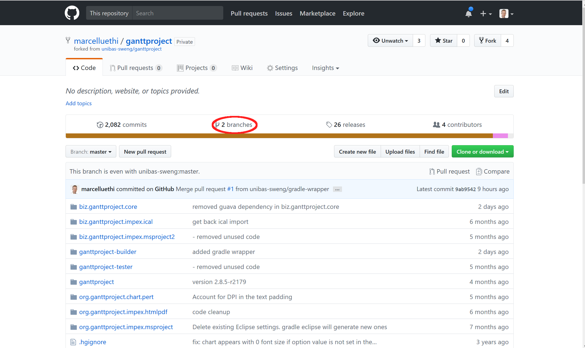
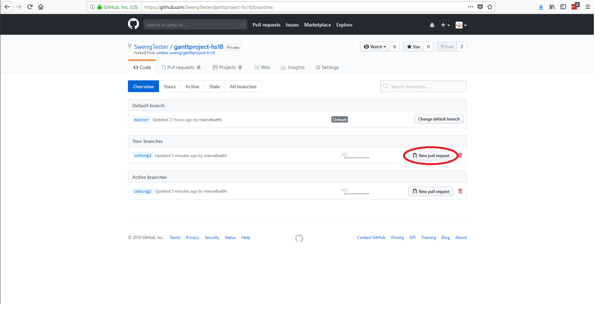
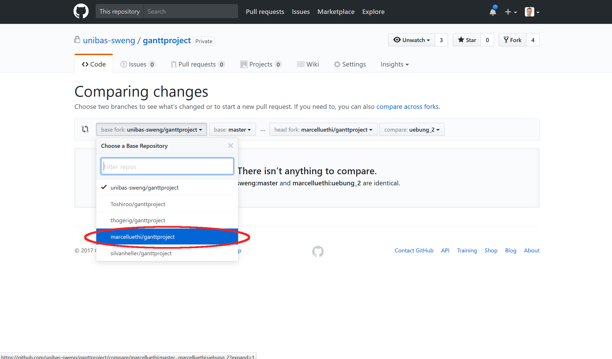
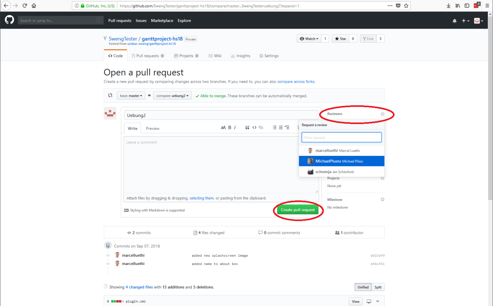

# &Uuml;bung 2 Ganttproject:  Erste &Auml;nderungen

## Administratives

* Dieses &Uuml;bungsblatt sollte bis am 10. Oktober 2017 bearbeitet werden.  
* Fragen und Probleme k&ouml;nnen in der  &Uuml;bungsstunde am 4. Oktober besprochen werden.   
* Abgabe via Pull Request bis sp&auml;testens 10. Oktober, 23.59.

## Einf&uuml;hrung

In dieser &Uuml;bung werden Sie erste eigene &Auml;nderungen an Ganttproject vornehmen. 
Das Ziel dieser &Uuml;bung ist, dass sie lernen die relevanten Konzepte im Code zu lokalisieren und bereits vorhandenen Code anzupassen oder zu imitieren.  
 

## Vorbereitung

Bevor sie eine &Auml;nderung am Projekt vornehmen, sollten sie immer mit git einen neuen Feature Branch erstellen. Dazu wechseln sie in ihr Projektverzeichnis und geben folgende Kommandos ein:
```
git branch uebung_2     
git checkout uebung_2
```

```git branch``` erstellt den Branch ```uebung_2``` und mittels ```git checkout``` k&ouml;nnen wir auf den entsprechenden Branch wechseln.

Mit 
``` 
git status 
```
k&ouml;nnen sie &uuml;berpr&uuml;fen auf welchem Branch sie gerade sind. Der Output sollte nun wie folgt aussehen:
```
On branch uebung_2
Untracked files:
  (use "git add <file>..." to include in what will be committed)
  ...
  ...
  ````

## Aufgaben

Nehmen sie die folgenden &Auml;nderungen am Projekt vor:

1. Ersetzen sie das Bild im Splashscreen durch ein Bild ihrer Wahl
2. Schreiben sie ihren Namen in die Aboutbox (Menu Help->About)
3. F&uuml;gen sie einen neuen Button in die Toolbar ein. Beim Klicken dieses Buttons soll ein Text auf der Kommandozeile ausgegeben werden (mittels ```System.out.println```).
4. F&uuml;gen sie ein neues Menu mit eigenen Menueintr&auml;gen hinzu.

Jede &Auml;nderung soll jeweils einem separatem Commit entsprechen. Von der Kommandozeile k&ouml;nnen sie via
```
git commit -a -m "Ihre message"
```
alle &Auml;nderungen commiten. Bitte schreiben Sie sinnvolle Commit Messages, die Ihre &Auml;nderungen gut beschreiben. Einige Hinweise wie gute Commit Messages aussehen sollen finden sie in diesem [Artikel](https://chris.beams.io/posts/git-commit/).


## Abgabe

Um ihre &Auml;nderung einzureichen, "pushen" sie den aktuellen Branch mittels dem Kommando
```
git push origin uebung_2
```
zur&uuml;ck auf github.

Die weitern Schritte passieren nun direkt auf ihrer Github Projektseite (also https://github.com/YOUR_USERNAME/ganttproject). 

Der neue Branch ```uebung_2``` sollte nun auch auf Github erscheinen. 
Sie k&ouml;nnen sich nun alle Branches anzeigen lassen, indem sie auf  ```Branches``` gehen:


W&auml;hlen Sie beim Branch uebung_2 ```New pull request```.

Auf der folgenden Seite k&ouml;nnen sie das Zielrepository ausw&auml;hlen. W&auml;hlen sie hier *ihr eigenes Repository* (also ```YOUR_USERNAME/ganttproject```). 

Auf der folgenden Seite k&ouml;nnen sie nun ihre &Auml;nderung kurz beschreiben, sowie die Reviewers angeben. Als Reviewers geben sie bitte ```marcelluethi```, ```silvanheller``` und ```marvinbuff``` an. 

Danach schliessen sie den Pull Request ab indem sie   ```Create Pull Request``` w&auml;hlen.

Damit werden die von ihnen angegebenen Review dar&uuml;ber informiert, dass sie gerne ihren Code in den ```master``` Branch mergen wollen, und das sie den Code gerne zuvor gereviewed habe m&ouml;chten. In einem richtigen Projekt hätten die Reviewer nun die Aufgabe, die Codequalit&auml;t zu pr&uuml;fen bevor der Code in den Zielbranch gemerged wird. Die Reviewer k&ouml;nnten gegebenenfalls auch &Auml;nderungen verlangen. 

In unserem Fall dient der Pull Request als Abgabe und erlaubt uns Ihre &Auml;nderungen komfortabel durchzuschauen. Sie erhalten das Feedback dann direkt via Github. 


