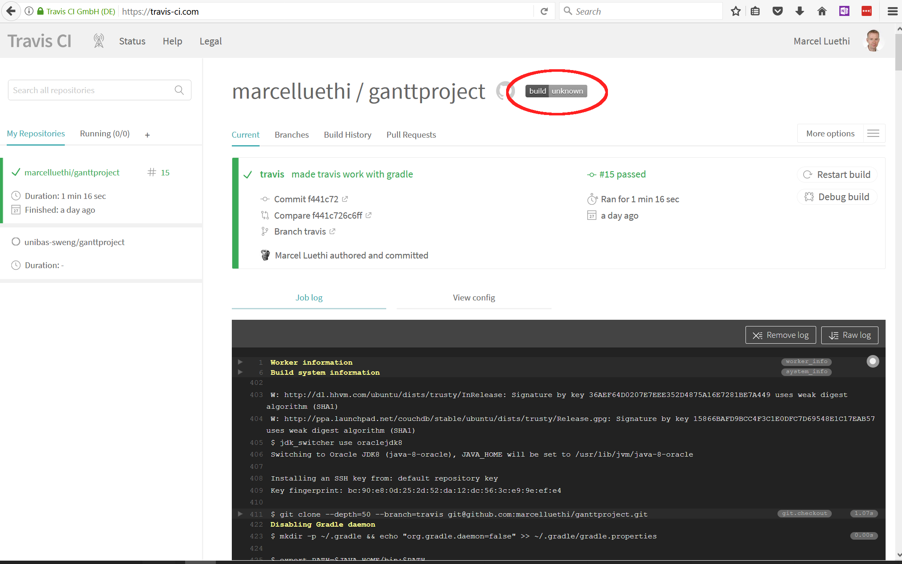

# &Uuml;bung 3 Ganttproject:  

## Administratives

* Dieses &Uuml;bungsblatt sollte bis am 17. Oktober 2017 bearbeitet werden.  
    * Abgabe via Pull Request bis sp&auml;testens 17. Oktober, 23.59.
* Fragen und Probleme k&ouml;nnen in den  &Uuml;bungsstunden am 4. und 11. Oktober besprochen werden.   


## Einf&uuml;hrung

In dieser &Uuml;bung werden Sie lernen wie sie &Auml;nderungen aus dem upstream Repository synchronisieren, was [Travis](www.travis-ci.com) ist und sich einen &Uuml;berblick &uuml;ber die Struktur des Codes verschaffen und Teile des Codes dokumentieren.  


## 1. Synchronisieren ihres Repositories mit dem Upstream Repository


#### Vorbereitung

Da wir die &Auml;nderungen der letzten &Uuml;bung hier nicht ben&ouml;tigen, starten wir wieder vom Master branch. Wir wechseln auf den Masterbranch mit 
```
git checkout master
```

Um sicherzustellen, dass sie auf dem richtigen Repository sind, nutzen sie das Kommando 
```
git branch
```
Sie sollten nun alle ihre Branches sehen. Vor dem aktiven Branch (also master) sollte nun ein Sternchen sein. 

#### Synchronisieren ihres Repositories mit dem Upstream Repository
In der ersten &Uuml;bung haben sie das ganttproject Repository via Github "Fork" dupliziert. Sie arbeiten nun auf einem Repository, welches komplett vom Ursprungsepository abgekoppelt ist. Dies bedeutet aber auch, dass wenn nun im Ursprungsepository &Auml;nderungen vorgenommen werden, diese keine Auswirkungen auf ihr Repository haben. 

Sie k&ouml;nnen jedoch diese &Auml;nderungen wieder manuell in ihr Projekt einpflegen. Dazu m&uuml;ssen sie zuerst das Ursprungsrepository als neues remote Repository hinzuf&uuml;gen. Dies machen sie mit 
```
git remote add upstream https://github.com/unibas-sweng/ganttproject.git
```
(Das Ursprungsrepository wird per Konvention upstream genannt. Sie k&ouml;nnten diesem jedoch einen beliebigen Namen geben. Es handelt sich hier nur um einen Kurznamen f&uuml;r die URL).

Verifizieren Sie das hinzufügen mithilfe von:

```
git remote -v
```

Als n&auml;chstes k&ouml;nnen sie die &Auml;nderungen via ```git pull``` zu sich ins Repository bringen. In unserem Fall m&ouml;chten wir die &Auml;nderungen vom Master Branch holen. Wir benutzen dazu das Kommando: 
```
git pull upstream master
```
Sie sollten nun folgende Ausgabe sehen (Die Details zum Update k&ouml;nnen bei ihnen abweichen).
```
From https://github.com/unibas-sweng/ganttproject
 * branch            master     -> FETCH_HEAD
Updating 9ab9542..ff7726f
Fast-forward
 .gitignore | 163 +++++++++++++++++++++++++++++++++++++++++++++++++++++++++++++
 1 file changed, 163 insertions(+)
 create mode 100644 .gitignore
```
Die Zeile ```Updating 9ab9542..ff7726f``` gibt ihnen die Commit Ids der ersten und letzten &Auml;nderung an. 

Um zu sehen welche &Auml;nderungen mit diesem Pull vorgenommen wurden, nutzen sie folgende git Kommandos
```
git log --name-status 9ab9542..ff7726f
```
oder
```
git diff 9ab9542..ff7726f
```
Das erste gibt ihnen alle Commit Messages der neuen &Auml;nderungen aus. Das letzere zeigt die "Diffs" der Dateien an.   

Ihr master branch des Repositories ist nun wieder auf dem aktuellen Stand ist und sie k&ouml;nnen sie mit der &Uuml;bung beginnen. 


## 2. Travis


#### Vorbereitung
Wie immer erstellen wir zuerst f&uuml;r unsere &Auml;nderungen einen lokalen Featurebranch und wechseln in diesen:

```
git branch exercise3     
git checkout exercise3
```

#### Was ist Travis

Sie haben gesehen, dass eine der neuen &Auml;nderungen die Datei .travis.yml betroffen hat. 

*Finden sie (z.B. mit google) heraus was Travis ist und wozu es gebraucht wird und beantworten sie folgende Fragen:*

1. Wozu brauchen wir Travis?
2. Was macht die Datei .travis.yml?
3. Weshalb sind solche Systeme in der modernen Softwareentwicklung unerl&auml;sslich?

Schreiben sie ihre Antworten in eine Textdatei Datei die sie ```exercise3.txt``` nennen. Die Datei k&ouml;nnen sie dem Projekt mit
```
git add exercise3.txt
```
hinzuf&uuml;gen. 


#### Travis aktivieren

Damit sie Travis auch f&uuml;r ihr Projekt verwenden k&ouml;nnen, m&uuml;ssen sie dies erst einrichten. Dazu gehen sie auf die die [Webseite](https://www.travis-ci.com) von Travis und melden sich mit ihrem Github Account an. Nach einer Weile sollten sie nun ihre Github Repositories sehen. Sie aktivieren Travis, indem sie beim entsprechenden Repository den Switch aktivieren (siehe Bild)


*Anmerkung: Travis ist ein kommerzieller Service. Sie haben aber 99 Trial runs zur Verf&uuml;gung. Dies sollte f&uuml;r diesen Kurs reichen. F&uuml;r Open Source Projekte ist Travis aber gratis nutzbar. Deshalb ist Travis der Standard Service in der Open Source Entwicklung*.

*Anmerkung 2: Wenn Sie sich für das [Github Educational Pack](https://education.github.com/pack) registriert haben, haben Sie gratis builds für private repositories. Falls Ihr Fork Public ist, müssen sie auf www.travis-ci.org wechseln. Die beiden Seiten sind identisch und werden von derselben Firma betrieben.*.


Probieren sie aus was passiert wenn sie Code committen (und auf Github pushen), der nicht kompiliert. 

#### Status batch ersetzen
Auf der &Uuml;bersichtsseite von Travis sehen sie oben einen "Batch" (siehe Screenshot)

Wenn sie auf diesen Klicken sehen sie eine URL. Diese URL zeigt auf ein kleines Bild (genannt Batch) welches den aktuellen Buildstatus von Travis anzeigt. Es ist &uuml;blich, dieses Bild in die Datei ```Readme.md``` des Projekts einzuf&uuml;gen. Im Falle von Ganttproject wurde dies schon gemacht - jedoch ist die URL falsch. 

* Ersetzen sie den Batch mit der richtigen URL. 


## 3. Code lesen

In diesem Teil der &Uuml;bung geht es darum, dass sie sich einen Grob&uuml;berblick &uuml;ber die Strukur des Ganttproject Codes erarbeiten sowie auch lernen, fremden Code zu lesen und zu verstehen.

#### Dokumentieren der Packages

Dokumentieren sie die Toplevel packages 

* ```biz.ganttproject.core```
* ```biz.ganttproject.impex.ical```
* ```biz.ganttproejct.impex.msproject2```
* ```ganttproject```
* ```ganttproject.tester```
* ```org.ganttproject.chart.pert```
* ```org.ganttproject.impex.html```

Sie k&ouml;nnen diese mittels Javadoc dokumentieren, indem sie in jedes Verzeichnis eine Datei
```package-info.java``` erstellen, die wie folgt aussieht
```
/**
 * Hier kommt ihre Beschreibung
 */
package biz.ganttproject.core; // package name 
```
Die Beschreibung sollte in max 2-3 S&auml;tzen den Zweck des Packages zusammenfassen.
Vergessen sie nicht, diese Files mit dem ```git add``` command dem Repository hinzuzuf&uuml;gen.

#### Dokumentieren sie eine Klasse

Dokumentieren sie die Klasse 
```net.sourceforge.ganttproject.task.TaskMutator``` sowie alle Methoden mittels Javadoc. Beschreiben sie in jeweis 2-3 S&auml;tzen was die Klasse sowie jede Methode macht. 


### Abgabe
Die Abgabe der &Uuml;bung erfolgt durch push des entsprechenden Branch 
```
git push origin exercise3
``` 
und entsprechenden Pull Request, bei dem sie 
```marcelluethi```, ```silvanheller``` und ```marvinbuff``` als Reviewer angeben.
(Details dazu finden sie in [&Uuml;bungsblatt 2](https://unibas-sweng.github.io/software-engineering/exercises/02-gant-small-changes.html)).
 
