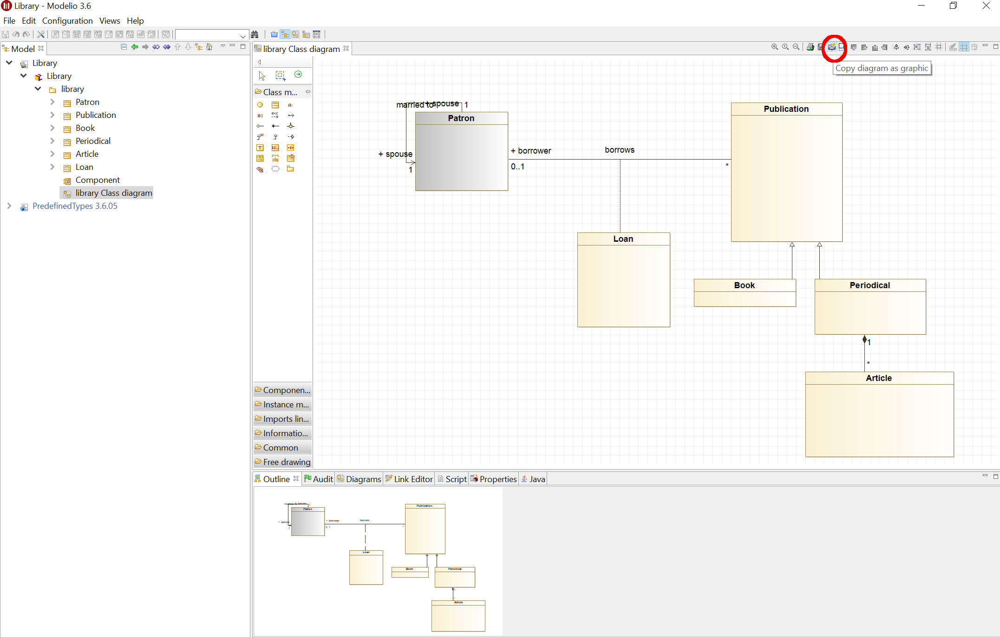

# Freiwillige Theorie&uuml;bung 4: UML Klassendiagramm

## Administratives

*Abgabe:* Individuelle Abgabe (als PDF oder png) bis sp&auml;testens 06.11.2017 (23:59) auf  [Courses](https://courses.cs.unibas.ch).

*Anmerkung:* Die &Uuml;bung ist freiwillig. Falls die &Uuml;bung erfolgreich bearbeitet und eingereicht wurde, 
z&auml;hlt sie als bestandene &Uuml;bung. Falls nichts abgegeben wird oder die Abgabe nicht den Anforderungen entspricht, wird sie in der Bewertung (d.h. in die Berechnung der erforderlichen 75% bestandener &Uuml;bungen ) nicht ber&uuml;cksichtigt.

## Aufgabe

Kreieren sie ein Klassendiagramm f&uuml;r das hier beschriebene [Bankomatenszenario](bankomat-szenario.html).
Benutzen sie zur Erstellung des Diagramms die Software [Modelio](https://www.modelio.org).

Es sollen mindestens die folgenden Klassen modelliert werden:

* Komponenten des Bankomat
    * Bankomat
    * Konsole
    * Karteneinzug
    * Geldausgabefach
    * Geldeinzug
    * Netzwerklink
    * Drucker
* Klassen f&uuml;r die verschiedenen Use cases
    * Transaktion
    * Session
    * Geldbezug
    * Einzahlung
    * Kontostandabfrage
* Weitere Entit&auml;ten
    * Karte
    * Nachricht
    * Quittung

Das Diagramm soll folgende Eigenschaften haben:
* F&uuml;r mindestens eine Klasse sollen sinnvolle Attribute und Methoden spezifiziert werden
* F&uuml;r alle Assoziationen m&uuml;ssen die Multiplizit&auml;ten angegeben werden
* Wo es sinnvoll ist, sollen Assoziationsnamen angegeben werden
* Das Diagramm soll sowohl Komposition als auch Vererbung beinhalten

*Tip 1:* Sie finden ein Klassendiagramm f&uuml;r ein &auml;hnliches Szenario [hier](http://www.math-cs.gordon.edu/courses/cs211/ATMExample/). Dies d&uuml;rfen sie gerne als Inspiration nehmen. 

*Tip 2:* Falls sie die Funktionalit&auml;t von Modelio nicht gleich intuitiv verstehen, gibt es auf der Modelio Website [Videotutorials](https://www.modelio.org/resources-menu/videos.html). Durch die weite Verbreitung der Software hilft auch eine einfache Googlesuche oft weiter. 

*Tip 3:* Eine .png Grafik kann direkt aus Modelio exportiert werden.  Dazu klicken sie auf den Button "Save Diagram in File" in der Toolbar, wie auf dem Bild gezeigt. 

