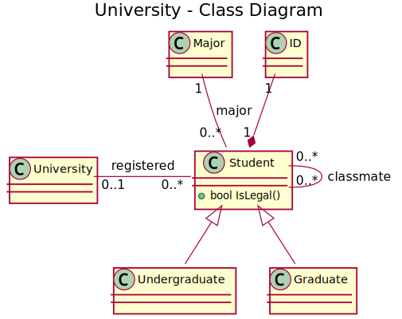

# Statisches Modellieren mit Alloy


## Aufgabe 1

Erstellen Sie ein Alloy-Modell des unten beschriebenen Systems:

- Es gibt Bachelor-Studenten und Master-Studenten, kein Student ist gleichzeitig Bachelor- und Master-Student;
- ein Student muss sich an einer Universität einschreiben, und nur eingeschriebene Studenten sind legale Studenten;
- jeder Student hat eine eindeutige Studenten-ID und genau ein Hauptfach;
- Studenten mit demselben Hauptfach, die an derselben Universität eingeschrieben sind, gelten als Kommilitonen; ein Student kann mehrere Kommilitonen haben;
- Bachelor- und Master-Studenten sind niemals Kommilitonen;
- die Kommilitonen-Beziehung ist nicht reflexiv (ein Student kann nicht sein/ihr eigener Kommilitone sein).

Versuchen Sie sich grob an folgendem UML-Diagramm zu orientieren:



## Aufgabe 2

*(Exercise A.3.3 auf Seite 243 von Software Abstractions von Daniel Jackson)*

Betrachten Sie die Menge aller Mengen, die sich selbst nicht als Element enthalten. Enthält sie sich selbst?

In dieser Übung werden Sie ein kleines Modell ändern, das auf Russells berühmter Variation dieses Problems basiert – dem Barbier-Paradoxon: In einem Dorf, in dem der Barbier jeden Mann rasiert, der sich nicht selbst rasiert, wer rasiert den Barbier?

1. Verwenden Sie den Analyzer, um zu zeigen, dass das Modell tatsächlich inkonsistent ist, zumindest für Dörfer kleiner Größe.
2. Einige Experten haben darauf hingewiesen, dass das Paradoxon verschwindet, wenn die Existenz von Frauen anerkannt wird. Erstellen Sie eine neue Version des Modells, die die Dorfbewohner in Männer (die rasiert werden müssen) und Frauen (die das nicht müssen) einteilt, und zeigen Sie, dass es nun eine Lösung gibt.
3. Eine drastischere Lösung, die Edsger Dijkstra vorgeschlagen hat, besteht darin, die Möglichkeit zuzulassen, dass es keinen Barbier gibt. Ändern Sie das ursprüngliche Modell entsprechend und zeigen Sie, dass es nun eine Lösung gibt.
4. Erstellen Sie schließlich eine Variante des ursprünglichen Modells, die mehrere Barbiere erlaubt. Zeigen Sie, dass es wieder eine Lösung gibt./

Nutzen Sie dazu folgende Code als Startpunkt: 

```alloy
sig Man {shaves: set Man}

one sig Barber extends Man {}

fact {
   Barber.shaves = {m: Man | m not in m.shaves}
}

run { }
```

## Aufgabe 3


*(Exercise A.3.1 auf Seite 243 von Software Abstractions von Daniel Jackson)*


Ein Lied von Doris Day hat folgenden Text:

> Everybody loves my baby but my baby don’t love nobody but me

Von einem strikt logischen Standpunkt aus bedeutet dies „Ich bin mein Baby“.

Überprüfen Sie dies indem Sie das Lied mittels Constraints ausdrücken und eine entsprechende Assertion schreiben. 

Modifizieren Sie dann die Constraints, um auszudrücken, was Doris Day wahrscheinlich gemeint hat, und zeigen Sie, dass die Assertion nun ein Gegenbeispiel hat.

Nutzen Sie dazu folgenden Code als Startpunkt:
```alloy

sig Person {
  loves: set Person
}

one sig Me extends Person {}
```