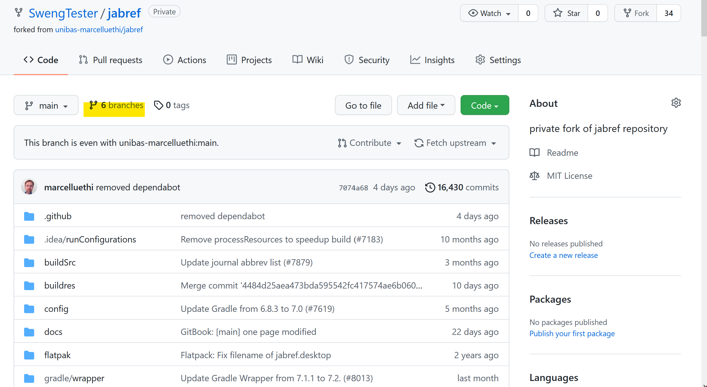
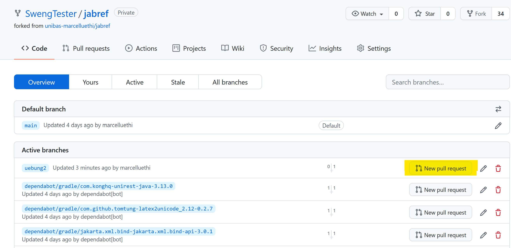
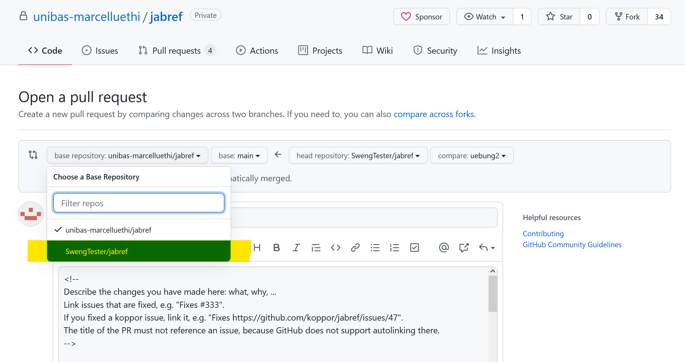
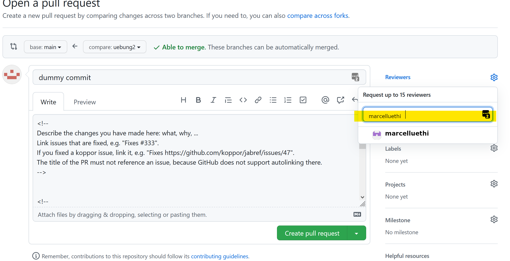

# Praktische Übung 2: Erste Codeänderungen und Pull Requests

## Administratives

* Eine kurze Einführung in Git/Github und Hilfestellungen zu den Aufgaben gibt es in der Übungsstunde.
* Dieses Übungsblatt muss bis spätestens am 03. Oktober via Pull Request abgegeben werden.


In dieser Übung werden Sie einen typischen Arbeitsablauf mit Git durchspielen. 
Dieser Ablauf wird in ähnlicher Form immer dann vorkommen, wenn Sie ein neues Feature für eine auf Github gehostete Software entwickeln wollen. 
Das Ziel dieser Übung ist, dass Sie sich mit den wichtigsten Befehlen und Abläufen in Git vertraut machen und auch das Zusammenspiel verschiedener lokaler und verteilter Repositories besser verstehen.

Sie werden zudem auch ihre ersten kleinen Änderungen in JabRef vornehmen. 
Dabei werden Sie lernen, relevante Konzepte im Code zu lokalisieren und bestehenden Code zu imitieren.


*Bemerkung:* Obwohl es viele grafische Tools gibt die das Arbeiten mit *Git* unterstützen, nutzen wir in unseren Übungen die Kommandozeile. 
Wir empfehlen auch Ihnen am Anfang nur mit der Kommandozeile zu arbeiten. Sie sehen besser was passiert und es ist einfacher bei Problemen eine Antwort im Internet zu finden.


## Upstream Repository hinzufügen

In der ersten Übung haben Sie JabRef Repository (genauer, unseren privaten Fork des JabRef Repository) via Github "geforked". 
Dadurch wurde das Repository dupliziert und unter Ihrem Benutzer hinzugefügt. 
Die beiden Repositories sind komplett unabhängig. 
Wenn Sie eine Änderung an ihrem JabRef Repository vornehmen, hat dies keine Auswirkung auf das original JabRef Repository. 
Umgekehrt gilt aber auch, dass alle Änderungen (Bugfixes, Erweiterungen, neue Entwicklungen) am original Repository bei Ihnen nicht sichtbar sind.
Sie müssen diese Änderungen explizit abholen und bei Ihnen hinzufügen. 
Dazu erlaubt Ihnen *Git* mehrere Repositories zu verwalten.

Im Folgenden nennen wir das von Ihnen geforkte Repository *origin* und das original Repository *upstream*.
Durch das Klonen von ihrem *origin* Repository mittels ```git clone```, haben Sie git bereits mitgeteilt, wo ihr *origin* Repository liegt.
Mit dem Befehl
```
git remote -v
```
können Sie sich die URL davon anzeigen lassen.

Damit Sie auf die Änderungen vom *upstream* Repository zugreifen können, müssen Sie dies als weiteres remote Repository hinzufügen. 
Wenn Sie ssh benutzen (also in der vorigen Übung ssh eingerichtet haben) geben 
Sie dafür folgendes Kommando ein
```
git remote add upstream git@github.com:unibas-marcelluethi/jabref.git
```
Falls Sie ein Access Token verwendet haben, geben Sie stattdessen folgenden Befehl ein:
```
git remote add upstream https://github.com/unibas-marcelluethi/jabref.git
```

Verifizieren Sie, dass das Hinzufügen erfolgreich war, mithilfe des Befehls:
```
git remote -v
```
Sie sollten nun nicht nur das *origin* sondern auch das *upstream* Repository sehen.


* *Bemerkung 1:*  Upstream ist hier nur ein Alias für die URL. Sie könnten auch direkt mit der URL arbeiten.
* *Bemerkung 2:*  Der Name vom Alias ist beliebig. Git nennt das Repository, von welchem man klont automatisch *origin*, es wäre aber möglich dies umzubenennen. 
Das Ursprungsrepository wird typischerweise *upstream* genannt.


## Synchronisieren ihres Repositories mit dem Upstream

Als Nächstes können sie die neusten Änderungen im *upstream* Repository via ```git pull``` zu sich ins Repository bringen.
In unserem Fall möchten wir die Änderungen vom *main* Branch holen. Wir benutzen dazu das Kommando:
```
git pull upstream main
```
Dieser Befehl kopiert die Commits vom *main* Branch des *upstream* Repositories in den aktuellen Branch in ihrem lokalen Git Repository.


Falls sich nichts geändert hat, sollten Sie folgende Ausgabe sehen:
```
From https://github.com/unibas-marcelluethi/jabref
 * branch                main     -> FETCH_HEAD
Already up to date.
```
Falls es neue Commits gegeben hat, könnte die Ausgabe etwa so aussehen.
```
From https://github.com/unibas-marcelluethi/jabref
 * branch                main       -> FETCH_HEAD
   b14a0835f..fb9665a1d  main       -> origin/main
Updating b14a0835f..fb9665a1d
Fast-forward
 README.md | 2 ++
 1 file changed, 2 insertions(+) ```
```

*Hinweis: Diese Commits sind nur ein Beispiel und werden bei Ihnen eventuell anders aussehen.*

Die Zeile ```Updating b14a0835f..fb9665a1d``` gibt ihnen die Commit-ids der ersten und letzten Änderung an.
Um zu sehen welche Änderungen mit diesem Pull vorgenommen wurden, nutzen sie folgende *Git* Kommandos:
```
git log  b14a0835f..fb9665a1d
```
oder
```
git diff  b14a0835f..fb9665a1d
```
Das Erste gibt Ihnen alle Commit Messages der neuen Änderungen aus. 
Das Letztere zeigt die "Diffs" der Dateien an.

In jedem Fall ist Ihr (lokaler) *main* Branch nun wieder auf dem aktuellen Stand und Sie können damit beginnen Ihre erste Änderung zu implementieren.
Damit Sie diese Änderung nicht nur auf Ihrem Computer, sondern auch im *main* Branch des *origin* Repositories auf Github haben, müssen Sie diese durch
```
git push origin main
```
synchronisieren.

## Einen Featurebranch erstellen

Bevor Sie irgendeine Änderung am Projekt vornehmen, sollten Sie immer mit git einen neuen Featurebranch erstellen. 
Damit sind immer alle Änderungen, die zu einem Feature gehören, klar getrennt. 
Das gibt Ihnen die Möglichkeit an mehreren unterschiedlichen Aspekten des Projekts parallel zu arbeiten,
ohne dass sich die jeweiligen Änderungen beeinflussen. 
Ausserdem werden so Ihre Änderungen auch logisch strukturiert, was es später einfacher macht die *Git History*, also den Verlauf der Änderungen, zu verstehen.

Um einen Branch zu erstellen wechseln Sie in Ihr Projektverzeichnis und geben folgende Kommandos ein:
```
git branch uebung2
git checkout uebung2
```

```git branch``` erstellt den Branch ```uebung2``` und mittels ```git checkout``` können wir auf den entsprechenden Branch wechseln.

Mit
```
git status
```
können sie überprüfen auf welchem Branch sie gerade sind. Der Output sollte nun wie folgt aussehen:
```
On branch uebung2
Untracked files:
  (use "git add <file>..." to include in what will be committed)
  ...
  ...
  ````


## Erste Änderungen

Ihre Aufgabe ist es nun, erste Änderungen an Jabref vorzunehmen. Dazu öffnen Sie 
JabRef in der Entwicklungsumgebung (IntelliJ)

#### Änderung 1:


* In der About box ("Menu: Help -> About JabRef") gibt es einen Link mit dem Namen "Engagieren Sie sich" oder "Get Involved", je nachdem ob bei Ihnen JabRef auf Deutsch oder English läuft. 
Ändern Sie den Link so, dass dieser neu nicht auf die JabRef Github Seite, sondern auf ihr privates JabRef Repository zeigt (https://github.com/GITHUB_USERNAME/jabref) zeigt.

*Tipp 1:* Verwenden Sie die Suchfunktionen *Search Everywhere* (```Shift Shift```) oder *Find in Path* (```Ctrl-Shift-F```) um die entsprechenden Stellen im Code zu finden.
*Tipp 2:* Neben den Java Dateien, müssen Sie auch die Dateien mit der Endung *.fxml anschauen. Diese enthält das eigentliche Layout der Elemente in der Dialogbox.
*Tipp 3:* Um zur Implementation einer Methode oder Klasse zu springen, drücken Sie die `Ctrl`-Taste und klicken Sie auf den Methoden oder Klassennamen. 


Wenn Sie die Änderung erfolgreich implementiert und getestet haben, können Sie diese committen. Dies machen Sie indem Sie die Dateien mit dem Befehl 
```
git add PFAD_ZU_DATEI_1 PFAD_ZU_DATEI_2 ... PFAD_ZU_DATEI_N
```
stagen und danach mit 
```
git commit -m "Ihre aussagekräftige Commitmessage"
```
commiten. 
Bitte schreiben Sie eine sinnvolle Commit-Message. 
Einige Hinweise wie gute Commit Messages aussehen sollen finden sie in diesem [Artikel](https://chris.beams.io/posts/git-commit/).
Schauen Sie sich auch den Stil der [Commit-Messages](https://github.com/JabRef/jabref/commits/main) bei JabRef an. Welche Zeitform wird verwendet?


#### Änderung 2
* Fügen Sie in die Toolbar zusätzlich zum Github Icon auch ein (beliebiges) Icon hinzu, welches beim Drücken auf unsere Vorlesungsseite (`https://unibas-marcelluethi.github.io/software-engineering`) springt.

Wenn Sie die Änderung erfolgreich implementiert und getestet haben, können Sie auch diese committen. 
Achten Sie auch hier auf eine sinnvolle Commit-Message.


## Abgabe Ihrer Änderung

Um ihre Änderung einzureichen, "pushen" Sie den aktuellen Branch mittels dem Kommando
```
git push origin uebung2
```
zurück auf github. 
Wenn Sie jetzt auf ihre Github Projektseite gehen (also https://github.com/YOUR_USERNAME/jabref), sollte Ihnen Github anzeigen, dass Sie soeben den neuen Branch ```uebung_2``` auf Github gepushed haben.

In einem realen Open Source Projekt möchten Sie jetzt Ihre Änderungen wieder in das *upstream* Repository einfliessen lassen. 
Dies macht man via einem *Pull Request*, welcher den Maintainer des *upstream* Repositories darüber informiert, dass man Änderungen vorgenommen hat, die man gerne zurückführen möchte.

Dazu zeigen Sie sich zuerst alle verfügbaren Branches an:




Wählen Sie beim Branch uebung_2 ```New pull request```.



Auf der folgenden Seite können sie das Zielrepository auswählen. 
Hier würden Sie normalerweise das Upstream repository wählen.

*WICHTIG! Da wir in diesem Projekt nicht alle Ihre Änderungen im upstream Repository wollen, wählen Sie hier stattdessen Ihr eigenes Repository (also ```YOUR_USERNAME/jabref```).*



Auf der folgenden Seite können Sie nun Ihre Änderung kurz beschreiben, sowie einen Reviewer angeben. Geben Sie hier den Ihnen zugeordneten Reviewer (siehe [diese Liste](https://adam.unibas.ch/goto_adam_file_1659074_download.html)) an. 



Danach schliessen Sie den Pull Request ab indem Sie ```Create Pull Request``` wählen.

Damit werden die von Ihnen angegebenen Reviewers darüber informiert, dass Sie gerne Ihren Code in den ```main``` Branch mergen wollen, und dass zuvor eine Review durchgeführt werden soll. 
In einem richtigen Projekt hätten die Reviewer nun die Aufgabe, die Codequalität zu prüfen bevor der Code in den Zielbranch gemerged wird. Die Reviewer könnten gegebenenfalls auch Änderungen verlangen.

In unserem Fall dient der Pull Request als Abgabe und erlaubt uns Ihre Änderungen komfortabel durchzuschauen. Sie erhalten das Feedback dann direkt via Github.

*Beachten Sie: Es ist wichtig, dass Sie diese Pull Requests gewissenhaft machen und den richtigen Zielbranch angeben. Falls versehentlich ein solcher Pull Request vom Maintainer des Originalprojekts übernommen wird, kann dies sonst zu erheblichem Chaos im Repository führen.*

