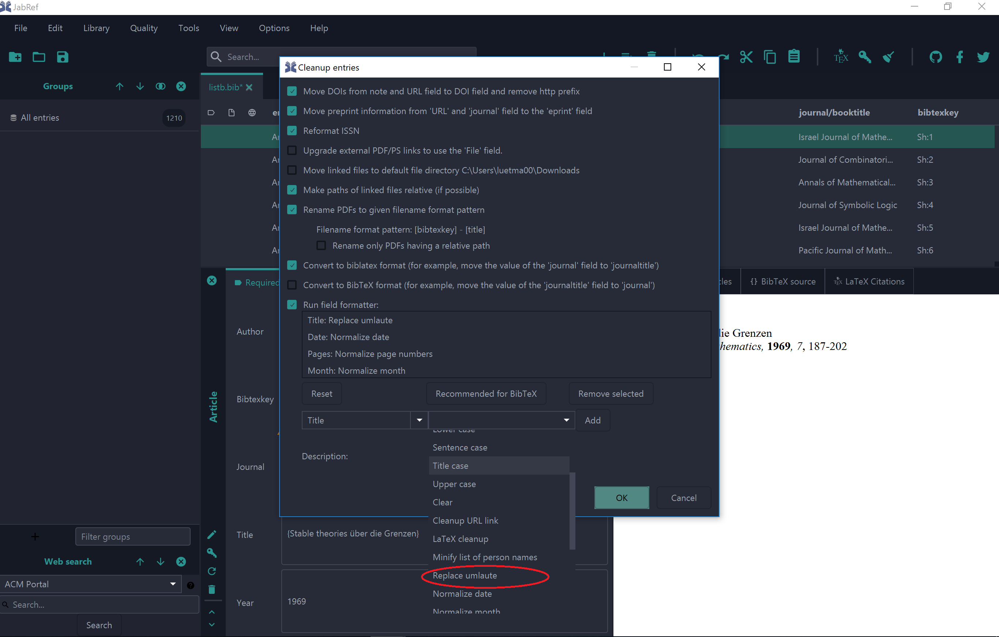

# Bonusblatt: Eigener Formatierer beim Cleanup


* Dieses Übungsblatt sollte bis am 17. November 2020 bearbeitet werden.
* Abgabe via Pull Request bis spätestens 17. November, 23.55.

*WICHTIG! Die Abgabe muss einzeln bearbeitet werden. Gruppenarbeiten sind nicht möglich.*

## Einführung


In dieser Übung werden Sie eine weitere Erweiterung an Jabref vornehmen. Sie werden nämlich einen Formatierer ```NormalizeUmlautInTitleFormatter``` hinzufügen bei welchem alle ä, ö, und ü im Titel einer Publikation durch  ae, oe und ue ersetzt werden.
Orientieren Sie sich dabei an ähnlichen Klassen, wie zum Beispiel dem ```NormalizeNamesFormatter``` oder dem ```NormalizePagesFormatter```.


## Vorbereitung

####  Erstellen eines Feature branch

Da wir die Änderungen der letzten Übung hier nicht benötigen, starten wir wieder vom Masterbranch.
```
git checkout master
```

Synchronisieren Sie ihr Repository mit den Änderungen vom *upstream* Repository, wie in [Übung 2](../../week2/exercises/practical-exercises) beschrieben  und pushen Sie den aktualisierten masterbranch in ihr github repository
```
git push origin master
```

Wie immer erstellen wir zuerst für unsere Änderungen einen lokalen Featurebranch und wechseln in diesen:

```
git branch bonusblatt
git checkout bonusblatt
```


## Anforderungen

#### Funktionale Anforderungen
* Der neue Formatierer muss über das Menu *Quality->Cleanup Entries* ausführbar sein.
    * Der neue Formatierer muss im Feld "Run field formatter" auswählbar sein.
        * Der Benutzer wählt dazu das Feld *Title* in der Dropdownliste und dann den entsprechenden Filter. Durch drücken des Buttons *Add* muss dieser dann in der Liste erscheinen (siehe Bild unten)
* Der Titel des neuen Formatters ist für die Sprachen Deutsch und Englisch übersetzt
    * Auf deutsch muss der Name wie folgt lauten: "Umlaute ersetzen"
    * Auf englisch muss der Name wie folgt lauten: "Replace umlaut"
* Wenn der Field Formatter ausgewählt ist und der Cleanup durchgeführt wird (durch drücken von OK) müssen im Titel des Eintrags die Umlaute ä, ö und ü durch ae, oe und ue ersetzt werden.
    * Entsprechend müssen die Umlaute in Grossbuchstaben ersetzt werden.
* Alle anderen Felder müssen unverändert bleiben.

#### Nichtfunktionale Anforderungen

* Alle neu hinzugefügten Methoden müssen mittels einem Kommentar (Javadoc) dokumentiert werden
* Jede neu hinzugefügte Klasse muss mittels einem Kommentar (Javadoc) dokumentiert werden
* Jede neu hinzugefügte Methode, die nicht nur eine Konstante zurückgibt, muss durch einen Unittest getestet werden.


## Abnahmekriterium

* Im Menu *Quality* kann der Punkt *Cleanup Entries* ausgewählt werden. Der Formatter kann über die Dropdownliste im Punkt *Run field formatters* ausgewählt werden. Nach drücken von *Ok*
werden die Umlaute im Title der ausgewählten Einträge ersetzt.
* Alle Methoden sind über Unittests getestet und mit Javadoc dokumentiert (siehe nichtfunktionale Anforderungen)

## Abgabe
Die Abgabe der Übung erfolgt durch push vom entsprechenden Branch:
```
git push origin bonusblatt
```
und entsprechenden Pull Request. Geben Sie bitte ```marcelluethi``` als Reviewer an.
(Details dazu finden sie in [&Uuml;bungsblatt 2](https://unibas-marcelluethi.github.io/software-engineering/week2/exercises/practical-exercises.html)).

## Anhang

