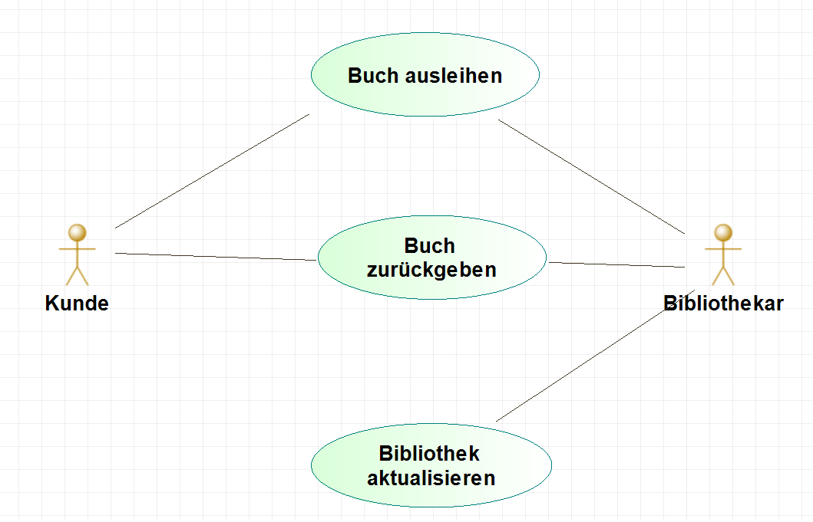

# Pflichtenheft 
#####  (Vorlage nach Balzert, Lehrbuch der Softwaretechnik (3 Auflage, Kapitel 20.3))

Das Pflichtenheft ist eine Verfeinerung und Pr&auml;zisierung des Lastenhefts.

| Version | Autor | Quelle | Status | Datum | Kommentar |
| ------- | ----- | ------ | ------ | ----- | --------- |
|  0.1    |  Name   | Name | in Bearbeitung | 01.01.1970 | |

## 1. Visionen und Ziele 
Beschreibung der Visionen und Ziele, die durch den Einsatz des Systems erreicht werden sollen. 

* /V10/ Vision 1 des Systems
* /Z10/ Ziel 1 des Systems

## 2. Rahmenbedingungen

Beschreibung der organisatorischen Rahmenbedingungen: Anwendungsbereiche, Zielgruppen, Betriebsbedingungen
(Wenn nicht relevant entsprechende Beispielkategorie l&ouml;schen)

* /R10/ Anwendungsbereich 1
* /R20/ Zielgruppe 1
* /R30/ Physikalische Umgebung 
* /R40/ Betriebszeit des Systems
* /R50/ Beobachtung des Systems durch Nutzer oder unbeaufsichtigter Betrieb
* /R60/ Eingesetzte Software auf der Zielmaschine
* /R70/ Eingesetzte Hardware einschl. Konfiguration auf der Zielmaschine
* /R80/ Organisatorische Randbedingungen
* /R90/ Software auf dem Entwicklungssystems
* /R100/ Hardware des Entwicklungssystems
* /R110/ Orgware (zur Bedienung/Einsatz benötigte Materialien (z.B. Betriebsanweisungen, Organisationspläne)
* /R120/ Entwicklungsschnittstellen

## 3. Kontext und &Uuml;berblick

Festlegung der relevanten Systemumgebung (Kontext) und &Uuml;berblick &uuml;ber das System:

* /K10/ Kontext 1

## 4. Funktionale Anforderungen
Die Kernfunktionailt&auml;t des Systems ist aus Auftraggebersicht auf oberster Abstraktionsebene zu beschreiben. 
Auf Detailbeschreibung ist zu verzichten. 

* /F10/ Funktion 1 des Systems
* /F20/ Funktion 2 des Systems

Erfolgt die spezifikation natürlichsprachlich, dann sollten Sprachtemplates verwendet werden. 

Die Funktionalen Anforderungen können mithilfe von Use-cases erhoben werden. Die Use-cases sollen in Anhang A detailliert beschrieben werden. 

## 5. Qualit&auml;tsanforderungen 
Es sollte anhand einer Tabelle eine Qualit&auml;tszielbestimmung f&uuml;r das Systems vorgenommen werden. 

| Systemqualit&auml;t  | sehr gut | gut | normal | nicht relevant |
| -------------------  | -------- | --- | ------ | -------------- | 
| Funktionalit&auml;t  |          |     |   x    |                 |
| Zuverl&auml;ssigkeit |          |     |   x    |                 |
| Benutzbarkeit        |          |     |   x    |                |
| Effizienz            |          |     |   x    |                 |
| Wartbarkeit          |          |     |   x    |                 |
| Portabilit&auml;t    |          |     |   x    |                 |

Einzelne Anforderungen k&ouml;nnen wie folgt festgelegt werden:

* /QB10/ Qualit&auml;tsanforderung zur Benutzbarkeit des Systems
* /QE10/ Qualit&auml;tsanforderung zur Effizienz des Systems

## 6. Abnahmekriterien  
Abnahmekriterien legen fest, wie Anforderungen bei der Abnahme auf ihre Realisierung &uuml;berpr&uuml;ft werden k&ouml;nnen. 

* /A10/ Abnahmekriterium 1
* /A20/ Abnahmekriterium 2

# Anhang

## Anhang A. Use-cases

An dieser Stelle können detaillierte Use-cases angegeben werden

### Use Case 1:
* Name: *Name des Use-cases*
* Akteure: *Akteur1, Akteur2, ...*
* Vorbedingungen: *Was muss vor Beginn des Ablaufs gelten*
* Standardablauf 
    * Schritt 1
    * Schritt 2
* Nachbedingungen Erfolg: *Was muss nach dem Ende des erfolgreichen Ablaufs gelten*
* Nachbedingung Fehlschlag: *Was gilt nach dem Ende, wenn der Ablauf fehlgeschlagen ist*

### Use Case 2:
* Name: *Name des Use-cases*
* Akteure: *Akteur1, Akteur2, ...*
* Vorbedingungen: *Was muss vor Beginn des Ablaufs gelten*
* Standardablauf 
    * Schritt 1
    * Schritt 2
* Nachbedingungen Erfolg: *Was muss nach dem Ende des erfolgreichen Ablaufs gelten*
* Nachbedingung Fehlschlag: *Was gilt nach dem Ende, wenn der Ablauf fehlgeschlagen ist*

