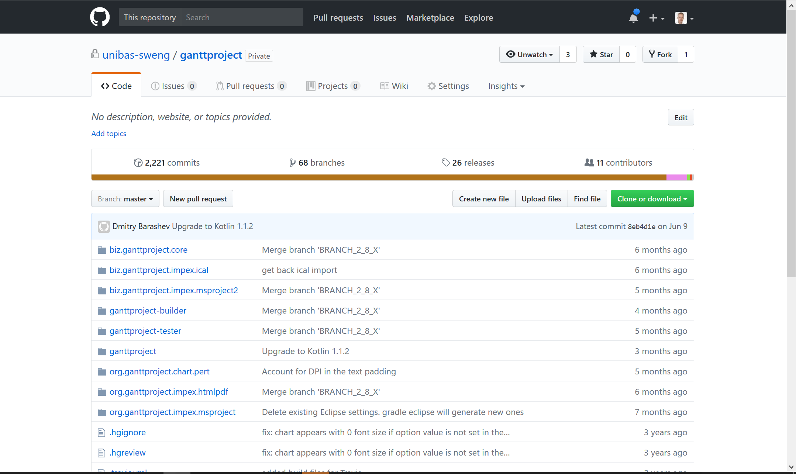

# Praktische Übung 1: Setup von Ganttproject

## Administratives

* Dieses Übungsblatt wird in der Übungsstunde vom 19. September besprochen und bearbeitet. Falls die Zeit in der Übungsstunde nicht reicht, sollte 
  das Setup bis zum 25. September 2018 fertiggestellt werden. 
* Es ist keine Abgabe erforderlich.

## Einführung

Für die meisten Übungen in diesem Kurs werden wir das Open Source Projekt [Ganttproject](http://www.ganttproject.biz/) verwenden. 
In dieser ersten übung werden Sie die Umgebung (Werkzeuge, Entwicklungsumgebung) aufsetzten, damit sie im folgenden Änderungen und Erweiterungen im Code vornehmen können. 

*Bemerkung: Wir nutzen in diesem Kurs einen Fork vom offiziellen Ganttproject. Unser Code basiert auf der Version 2.8.5 von Ganttproject verfügt aber über ein stark vereinfachtes und verbessertes Buildsystem, welches von Teilnehmern vom letztjährigen Kurs entwickelt wurde.*

## Vorbereitung

Falls sie noch keinen Benutzeraccount auf [Github](https://www.github.com) haben, erstellen sie bitte einen. Teilen sie uns Ihren Benutzernamen via Mail an 
jan.schoenholz@unibas.ch mit, damit wir Ihnen Zugriff auf das Code-Repository geben können.  

## Installation der Werkzeuge

### Git 

Installieren sie das Versionsverwaltungswerkzeug [Git](https://git-scm.com/). Informationen zu Download und Installation finden sie auf der Git [Homepage](https://git-scm.com/).

#### Test der Installation

öffnen sie eine Konsole. Eingabe von
``` 
git --version 
```
sollte die Version von Git ausgeben, also z.B.
```
> git version 2.18.0.windows.1
```

### IntelliJ Idea

Installieren sie die Entwicklungsumgebung [IntelliJ IDEA](https://www.jetbrains.com/idea/). Informationen zu Download und Installation finden sie auf der [Homepage](https://www.jetbrains.com/idea/). 

*Bemerkung 1:* Wir arbeiten in diesem Kurs mit der *Community Edition*, die als Open Source uneingeschränkt zugänglich ist. 

*Bemerkung 2:* Falls Sie bereits mit Java 10 arbeiten, sollten sie die aktuellste Version von IntelliJ (2.18.2.3) verwenden. Ansonsten können Probleme mit JavaFX auftreten. 

#### Test der Installation

Sie können die Entwicklungsumgebung starten (eine grafische Oberfläche sollte erscheinen).

### Fork von Ganttproject

Dieser Schritt setzt voraus, dass wir Ihnen bereits Zugriff auf unser privates Repository von ganttproject gegeben haben. Sie können dies überprüfen indem sie auf [https://github.com/unibas-sweng/ganttproject-hs18](https://github.com/unibas-sweng/ganttproject-18) gehen. 
Falls sie bereits Zugriff haben, sollte die Seite wie folgt aussehen:



Sie können das Projekt forken indem sie oben rechts auf den "Fork" Button klicken.    Nach erfolgreichem Fork landen sie nun auf ihrer persönlichen Kopie des Projekts, auf der sie von nun an arbeiten werden. 

##### Setzen der Projektzugriffsrechte

Wird ein Fork eines Projekts erstellt, wird nicht nur das ganze Coderepository, sondern auch alle Zugriffsrechte kopiert. Da alle Studierenden im Kurs auf das Original Repository zugreifen konnten, ist das also nun auch bei ihrem Repository der Fall. Deshalb müssen sie im nächsten Schritt noch die Zugriffsrechte anpassen. 
Dazu gehen sie auf ```Settings->Collaborators & Teams``` und entfernen das Team ```students-hs18``` durch Klicken auf das kleine Kreuz (siehe Screenshot).


### Klonen des Projekts

Damit sie an dem Projekt arbeiten können müssen sie das Repository noch auf Ihren eigenen Computer bringen (d.h. das Repository "klonen"). Drücken sie den grünen Button "Clone or Download" und kopieren sie die URL.
 
Öffnen sie eine Konsole, wechseln sie in ihr gewünschtes Arbeitsverzeichnis und geben sie folgendes ein:

```
git clone THE_URL_FOR_YOUR_PROJECT ganttproject
```

### Kompilieren des Projekts von der Kommandozeile

Bevor wir das Projekt in der IDE bearbeiten, versuchen wir es zuerst von der Kommandozeile zu kompilieren und auszuführen. 

Dazu wechseln sie zuerst in das Verzeichnis ```ganttproject-builder```:

```
cd ganttproject
cd ganttproject-builder
```

Dann führen sie folgende Kommandos aus (unter Windows muss ./ durch .\ ersetzt werden):

```
./gradlew updateLibs
./gradlew distBin
```

Diese Befehle holen sich die benötigten Bibliotheken aus dem Internet und kompilieren das Projekt. 

Mit dem Befehl
```
./gradlew runApp   
```
können wir das Projekt dann starten. 

### Bearbeiten des Projekts in der IDE

Wir werden in diesem Kurs hauptsächlich von der IDE arbeiten. Um das Projekt in Idea zu öffnen, müssen sie die gradle build Definition öffnen 
```
ganttproject\build.gradle
```
Die Datei öffnen sie mittels ```File->Open``` oder dem ```Open``` Button auf dem Startscreen von Idea.


Wählen sie nun "Open as project". Sie sollten nun mit dem Projekt arbeiten können. Um das Projekt zu kompilieren, wählen sie ```Build->Build Project```. 

Um das Projekt zu starten, öffnen sie die GradleView (Taskleiste rechts) und wählen sie die Task RunApp (siehe Screenshot):

 


Herzliche Gratulation! Sie sind nun in der Lage das Projekt nach ihren Wünschen zu verändern. Mehr dazu in den nächsten Übungen. 


