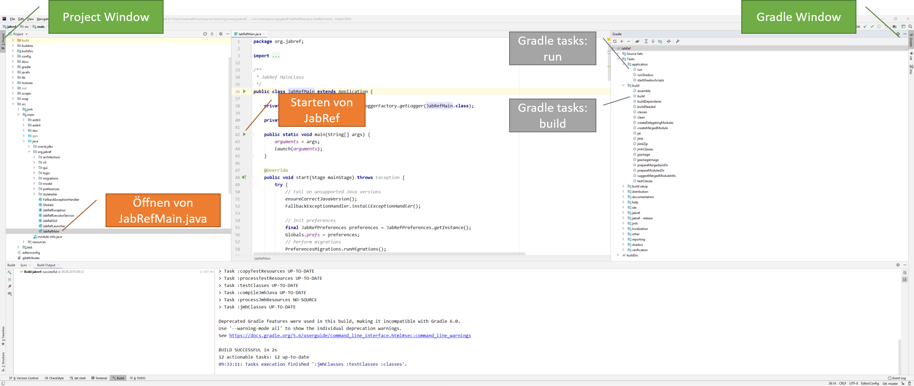

# Praktische Übung 1: Setup von Ganttproject

## Administratives

* Dieses Übungsblatt wird in der Übungsstunde vom 18. September besprochen und bearbeitet. Falls die Zeit in der Übungsstunde nicht reicht, sollte 
  das Setup bis zum 25. September fertiggestellt werden. 
* Es ist keine Abgabe erforderlich.

## Einführung


Für die meisten Übungen in diesem Kurs werden Sie das Open Source Projekt [JabRef](https://www.jabref.org/) verwenden. 
In dieser ersten Übung werden Sie die alle wichtigen Tools und die Entwicklungsumgebung aufsetzten, um im folgenden Änderungen und Erweiterungen im Code vornehmen zu können. 


## Benutzeraccount auf Github
Falls Sie noch keinen Benutzeraccount auf [Github](https://www.github.com) haben, erstellen Sie bitte einen. Teilen Sie uns Ihren Github Benutzernamen sowie Ihre Uni Basel E-Mail  Adresse via Mail an [marcel.luethi@unibas.ch](mailto:marcel.luethi@unibas.ch) mit, damit wir Ihnen Zugriff auf das Code-Repository geben können.  

*Auf Github ist dieser Benutzername sehr prominent und wird auch in der Projektkommunikation verwendet. Achten Sie deshalb bitte darauf, dass Sie einen Benutzernamen wählen, der professionelles Arbeiten zulässt. Gute Beispiele sind: ```andreasmeier``` oder ```andreas``` oder ```ameier```. Beispiele von ungeeigneten Namen sind ```coderking```, ```cookiemonster``` oder ```skaterboy```.*

## Installation der Werkzeuge

### Git 

Installieren Sie das Versionsverwaltungswerkzeug [Git](https://git-scm.com/). Informationen zu Download und Installation finden Sie auf der Git [Homepage](https://git-scm.com/).

#### Test der Installation

Öffnen Sie eine Konsole. Eingabe von
``` 
git --version 
```
sollte die Version von Git ausgeben, also z.B.
```
> git version 2.18.0.windows.1
```

### IntelliJ Idea

Installieren Sie die Entwicklungsumgebung [IntelliJ IDEA](https://www.jetbrains.com/idea/). Informationen zu Download und Installation finden Sie auf der [Homepage](https://www.jetbrains.com/idea/). 

*Bemerkung 1:* Wir arbeiten in diesem Kurs mit der *Community Edition*, die als Open Source uneingeschränkt zugänglich ist. 

#### Test der Installation

Sie können die Entwicklungsumgebung starten. Eine grafische Oberfläche sollte erscheinen.

### Fork von jabref

Im ersten Teil dieses Kurses arbeiten wir nicht mit dem offiziellen JabRef Code repository, sondern mit einem privaten Fork. Damit Sie auf diesen Fork zugreifen können, müssen wir Ihnen Zugriff auf dieses Repository geben. Sie können überprüfen ob Sie Zugriff haben indem Sie auf [https://github.com/unibas-marcelluethi/jabref](https://github.com/unibas-marcelluethi/jabref) gehen. 
Falls Sie bereits Zugriff haben, sollte die Seite wie folgt aussehen:

 

Sie können das Projekt forken indem Sie oben rechts auf den "Fork" Button klicken. Nach erfolgreichem Fork landen Sie nun auf Ihrer persönlichen Kopie des Projekts auf Github, mit der Sie von nun an arbeiten werden. 


### Klonen des Projekts

Damit Sie an dem Projekt arbeiten können müssen Sie das Repository noch auf Ihren eigenen Computer bringen (d.h. das Repository "klonen"). Drücken Sie den grünen Button "Clone or Download" und kopieren Sie die URL.
 
Öffnen Sie eine Konsole, wechseln Sie in ihr gewünschtes Arbeitsverzeichnis und geben Sie folgendes ein:

```
git clone THE_URL_FOR_YOUR_PROJECT
```

### Kompilieren des Projekts von der Kommandozeile

Bevor Sie das Projekt in der IDE bearbeiten, versuchen Sie es zuerst von der Kommandozeile zu kompilieren und auszuführen. 

Dazu wechseln Sie zuerst in das Verzeichnis ```jabref```:

```
cd jabref
```

Dann führen Sie folgende Kommandos aus (unter Windows muss ./ durch .\ ersetzt werden):

```
./gradlew compileJava
```

Mit dem Befehl
```
./gradlew run
```
können Sie das Projekt dann starten. 

### Bearbeiten des Projekts in der IDE

Sie werden in diesem Kurs hauptsächlich von der IDE arbeiten. Um das Projekt in Intellij Idea zu öffnen, müssen Sie die gradle Builddefinition öffnen 
```
jabref\build.gradle
```
Die Datei öffnen Sie mittels ```File->Open``` oder dem ```Open``` Button auf dem Startscreen von Idea.

Wählen Sie nun "Open as project". Sie sollten nun mit dem Projekt arbeiten können. Um das Projekt zu kompilieren, wählen Sie im Menu ```Build->Build Project```. 
Öffnen Sie nun die Datei ```src/main/java/org/jabref/JabRefMain.java``` und starten Sie das Programm durch klicken auf den grünen Pfeil neben der ```main``` Methode (sehe Screenshot). 

Alternativ können Sie das Projekt wie zuvor in der Konsole auch in der IDE durch Ausführen von Gradle tasks starten. Dazu öffnen Sie dias Gradle Tool Window und starten die
entsprechende Task (siehe Screenshot)/

 


Wenn alles geklappt hat sind Sie nun in der Lage JabRef nach ihren Wünschen zu verändern. Mehr dazu in den nächsten Übungen. 


