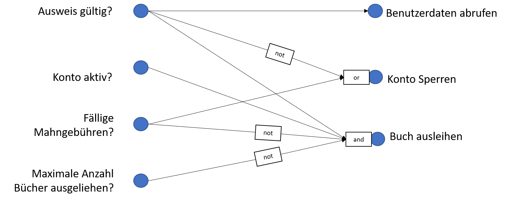

# Blackbox Testing

*In diesem Artikel schauen wir uns eine zweite Teststrategie an - das Blackbox Testing.
Im Gegensatz zum Whitebox Testing, werden die Testfälle hier aus den Spezifikationen 
hergeleitet.*

## Einführung
Wir haben im vorherigen Artikel zum Whitebox Testing gesehen, wie wir anhand Überlegungen zur
Codestruktur, Testfälle ableiten können. Mit Whitebox Testing testen wir hauptsächlich, ob 
unsere Implementation das macht, was wir als Programmierer ausdrücken wollten. Die Spezifikationen sind 
dabei unwichtig. Bei den Blackbox Tests hingegen, leiten wir die Testfälle aus den Spezifikationen ab. 
Der Vorteil dieser Art von Test ist klar: Während wir bei Whitebox tests bei jeder Implementationsänderung die Testfälle anpassen müssen, ist dies bei dieser Strategie nicht nötig. Wir testen ja nur den spezifizierten "Vertrag" eines Moduls, und nicht die Implementation. Wenn wir automatisierte Unittests für ein Programm schreiben, nutzen 
wir deshalb vorzugsweise Blackbox Tests.

## Herleiten von Testfällen aus Spezifikation
            
Um den Ansatz zu verdeutlichen, schauen wir uns an einem Beispiel an, wie wir aus einer gegebenen Spezifikation 
Testfälle herleiten können (Beispiel nach Ghezzi et al.):

> Das Programm bekommt als Input eine Repr&auml;sentation (Datenstruktur) einer Einzahlung. 
> Diese Einzahlung muss in eine Tabelle
> von Einzahlungen eingeordnet werden, welche nach Datum sortiert ist. Falls andere Einzahlungen mit
> demselben Datum existieren, wird die neue Einzahlung nach dem letzten Eintrag dieses Datums einsortiert.
> Es sollen auch verschiedene Konsistenzchecks durchgef&uuml;hrt werden:
> * Ist der Kunde bereits im Kundenverzeichnis
> * Stimmt der Name in den Verzeichnissen &uuml;berein
> * ...


Wir können aus dieser Spezifikation direkt zwei Gruppen von Tests herleiten. Einerseits müssen wir Testen, 
dass das Datum der Einzahlung richtig berücksichtigt wird. Andererseits müssen wir die Konsistenz testen. 
Beim formulieren der Testfälle versuchen wir auch hier zuerst Äquivalenzklassen zu finden, und dann 
für jede Äquivalenzklasse möglichst gute Repräsentanten zu finden. 

Als mögliche Äquivalenzklassen haben wir:
* Das aktuelles Datum liegt in der Vergangenheit/Zukunft
* Es gibt keine/mehrere Zahlungen an diesem Tag
* Name ist/ist nicht im Kundenverzeichnis
* Zahlung ist mit Datenbank konsistent/inkonsistent


#### Grenzfälle testen
Die Erfahrung hat gezeigt, dass Fehler in Programmen häufig an der Grenze zwischen den Äquivalenzklassen auftreten.
Deshalb definiert man wenn möglich nicht nur  Testfälle für de Äquivalenzklassen, sondern immer auch 
einen Testfall an dieser Grenze. In unserem Beispiel würden wir also noch separat testen was passiert, 
wenn das Datum der Einzahlung heute ist, und wenn es genau *eine* Zahlung gibt.

*Anmerkung: Diese Beobachtung gilt nicht nur für Blackbox Tests. Auch bei Whitebox Tests sollten wir immer
einen Testfall an der Grenze zwischen zwei Äquivalenzklassen definieren.*


## Ursache Wirkungsgraphen

Eine weitere hilfreiche Technik zum finden von Testfällen aus der Spezifikation sind Ursache-Wirkungsgraphen.
Die Idee dahinter ist, dass wir aus der Spezifikation die Bedingungen identifizieren, welche zu bestimmten Aktionen führen. Für jede Kombination von Bedingungen/Aktionen erhalten wir dann einen Testfall. 

Wir schauen uns zuerst wieder ein Beispielszenario an:
> Ein Kunde kommt in die Bibliothek und will sich ein Buch ausleihen. 
> Die Bibliothekarin prüft als erstes seinen Ausweis und ob das Benutzerkonto aktiv ist. 
> Falls der Ausweis nicht gültig ist und oder falls der Kunde fällige Mahngebühren nicht bezahlt hat, 
> wird das Konto gesperrt. Falls das Konto aktiv ist, wird zusätzlich überprüft ob der Kunde bereits 
> die maximal mögliche Anzahl von Büchern ausgeliehen hat. 
> Falls dies der Fall ist wird der Ausleihwunsch zurückgewiesen. 
> Ansonsten wird dem Kunden das gewünschte Buch ausgeliehen.

Wir können daraus folgenden Ursache-Wirkungsgraph erstellen. 

Auf der linken Seite sehen wir die verschiedenen möglichen Ursachen, auf der rechten Seite die möglichen Aktionen.
Ein Pfeil zwischen einer Ursache und einer Aktion bedeutet, dass wenn die entsprechende Bedingung erfüllt ist, dass dann daraus die entsprechende Aktion folgt. Für bestimmte Aktionen müssen mehrere Bedingungen erfüllt sein, oder es reicht, wenn eine von mehreren Bedingungen erfüllt ist. Dies modellieren wir mit den logischen Konjunktoren, ```and```und ```or```.  Es kann auch sein, dass für eine Aktion eine bestimmte Ursache nicht gelten kann, also die entsprchende Bedingung nicht erfüllt ist. Um dies auszudrücken, können wir die Negation ```not``` verwenden. 
Wir können aus diesem Uses Graphen unter anderem folgende Zusammenhänge ablesen:

* Wenn der Ausweis gültig ist, werden die Benutzerdaten abgerufen  
* Wenn der Ausweis nicht gültig ist, oder Mahngebühren fällig sind, dann wird das Konto gesperrt.
* Wenn der Ausweis gültig ist, das Konto aktiv ist, keine Mahngebühren fällig sind, und die maximale Anzahl Bücher noch nicht ausgeliehen sind, dann kann der Kunde das Buch ausleihen. 

Um aus einem Ursache Wirkungsgraph Testfälle abzuleiten, können wir diesen in eine Entscheidungstabelle umformulieren.
Wir sehen hier die dem obigen Graphen entsprechende Tabelle.

|Bedingungen|||||||
|----------|---|---|---|---|---|---|
| Ausweis gültig?      | N | J | J | J | J | J |
| Konto aktiv?         | - | N | N | J | J | J | 
| Fällige Mahngebüren? | - | J | N | J | N | N |
| Max Anzahl Bücher?   | - | - | - | - | N | J |

| Aktionen |||||||
|----------|---|---|---|---|---|---|
| Benutzerdaten abrufen | N | J | J | J | J| J |
| Konto Sperren | J | J | N | J | N | N | 
| Buch ausleihen | N | N | N | N | J | N | 

In jeder Spalte haben wir eine mögliche Kombination von Bedingungen. Wenn der Wert einer Bedingung für eine Aktion nicht relevant ist, haben wir dies mit - angegeben.  Im unteren Teil der Tabelle sehen wir die Aktionen, die für die 
entsprechende Konfiguration von Bedingungen gelten muss. Wir erhalten aus dieser Tabelle wieder ein *Überdeckungskriterium*. Um für dieses Kriterium vollständige Überdeckung zu erreichen, sollten wir für jede Spalte einen Testfall definieren. Für jeden Testfall spezifiziert die Tabelle genau die Bedingungen die erfüllt sein müssen, und was die gewünschte Aktion ist. 


## Testorakel 

Wir habe nun verschiedene Möglichkeiten gesehen, wie wir Testfälle definieren. Die Testfälle definieren die 
Menge der Eingaben, für die wir das Programm testen müssen. Um zu entscheiden, ob der Test erfolgreich war, 
müssen wir aber zusätzlich wissen, was denn die richtige Ausgabe für diesen Testfall ist. Wir brauchen ein 
sogenanntes *Testorakel*, welches uns zu jedem Testfall den richtigen Output gibt. Ein Testorakel ist besonders
bei automatisierten Tests wichtig, da hier ja kein Mensch involviert ist, der die Korrektheit beurteilen könnte. 
Das Design von einem Testorakel ist häufig kein triviales Unterfangen.

Im idealfall haben wir formale Spezifikationen, die uns für jeden Testfall genau die richtige Antwort (die Postcondition) vorgeben. In diesem Fall können wir die Spezifikation einfach in die Programmiersprache übersetzen und somit unser Testorakel
implementieren. Falls dies nicht der Fall ist, und die Anzahl der Testfälle eher klein ist, können wir die richtige 
Antwort durch einen "Experten" (den Entwickler/Kunde) bestimmen lassen. In manchen Fällen haben wir bereits ein anderes Programm zur Verfügung, welches wir benutzen können um den gleichen Testfall zu implementieren. 
Bei diesem Programm kann es sich beispielsweise um eine ältere Version unserer Software handeln, oder um ein Konkurrenzprodukt. Vor allem in 
wissenschaftlicher Software können wir versuchen durch heuristiken eine zweite, approximative Lösung zu entwickeln und
die Lösung unsere Software mit dieser zu vergleichen. Eine weitere Möglichkeit ist, dass wir gewisse statistische Eigenschaften der Lösung testen. Wir wissen vielleicht, dass der Mittelwert oder die Varianz einer Berechnung um einen 
bestimmten Wert liegt oder diese gewisse Konvergenzeigenschaften erfüllen. 

Wir sehen also, dass sich spätestens beim Testen zeigt, ob wir das Softwaresystem ausreichend spezifiziert haben, 
so dass wir es auch verifizieren können. Falls dies nicht der Fall ist, liefern wir dem Kunden nicht nur ein schlecht spezifiziertes, sondern auch weitgehend ungetestetes Produkt aus. 

<!-- 
                <section>
                    <h3>Unit Tests</h3>
                    <ul>
                        <li>Weshalb wird f&uuml;r automatisierte Unit Tests Black Box Testing empfohlen?</li>
                        <li>Wie helfen uns Entscheidungstabellen systematisch zu testen?</li>
                        <li>Was ist ein Testorakel?</li>
                        <ul><li>Weshalb sind Testorakel einfacher f&uuml;r Black box Tests als f&uuml;r White box Tests zu definieren?</li></ul>
                        <li>Weshalb sollte man immer Elemente an der Grenze von &Auml;quivalenzklassen testen?</li>
                    </ul>
                </section>
                -->
