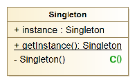
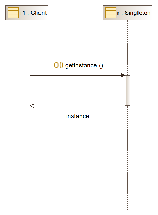
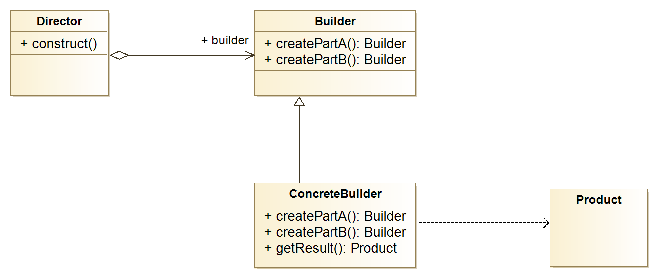
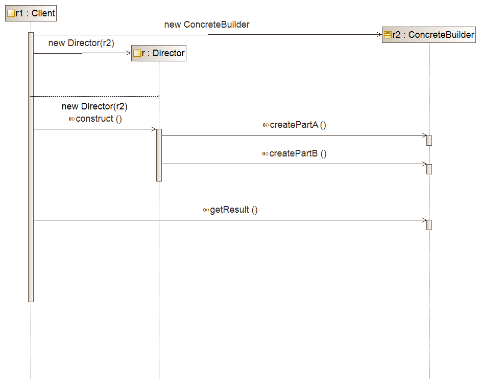
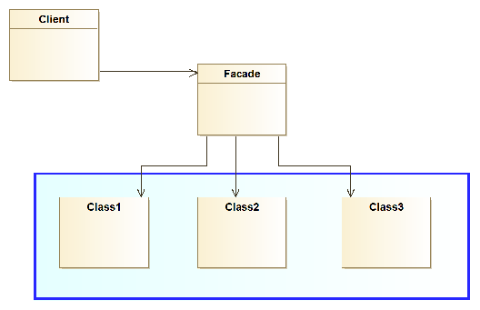
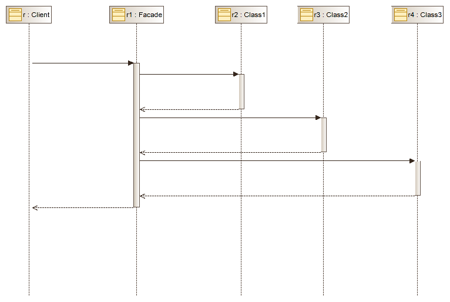
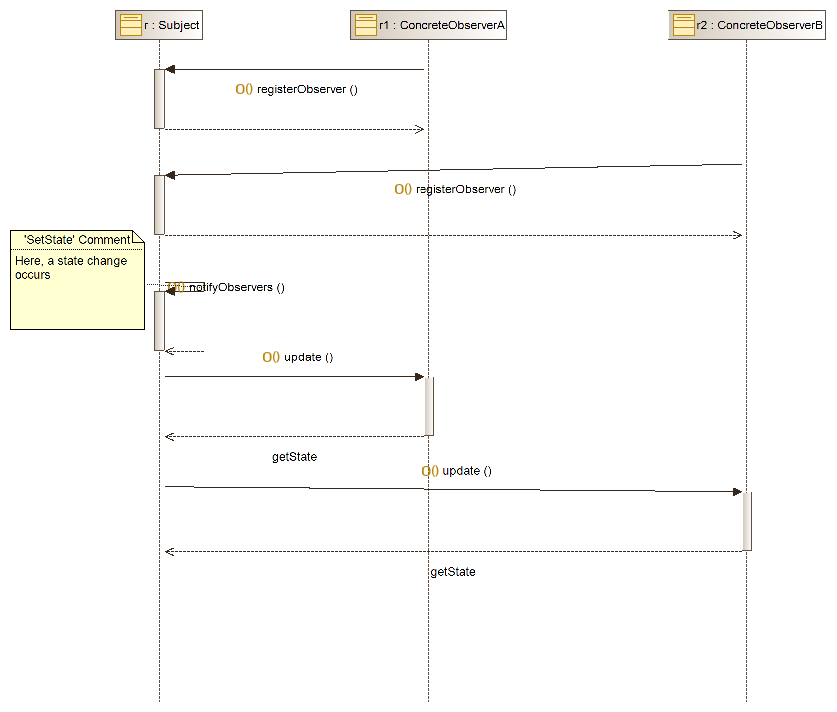

# Weitere wichtige Design Patterns

*In diesem Artikel schauen wir uns einige weitere wichtige Design Patterns an, die Sie wahrscheinlich in der Praxis immer wieder antreffen werden. Es gibt jedoch noch viele andere wichtige Design Patterns, die sie im Verlauf ihrer Karriere erlernen müssen. Da sich jedoch mit der Entwicklung des Gebiets und der Programmiersprache, auch die wichtigen Design Patterns ändern, ist das erlernen der relevanten Patterns eher Teil des Berufsalltags von Softwareingenieuren.*

## Das Singleton Pattern

Das allereinfachste Designpattern ist das *Singleton pattern*. Es wird angewendet, wenn wir sicher stellen wollen, dass nur eine Instanz von einer Klasse erstellt wird. Das *Singleton* Pattern ist also ein weiteres Beispiel eines Erzeugungsmusters.

#### Beispiele
Beispiele dafür gibt es viele: So sollte in einem Betriebssystem immer nur ein Window-Management-System aktiv sein, das alle Fenster verwaltet. Beim Drucken laufen alle Aufträge über genau einen *Druckerspooler*. Oder wir wollen, dass wir genau über ein Objekt Zugriff auf die Konfiguration eines Systems haben. 

#### Klassen- und Sequenzdiagramm

Das Klassendiagramm ist sehr einfach. Es gibt nur eine Klasse, nämlich die, von der die Instanz erstellt werden soll. 
<figure>
    
</figure>
Um eine Instanz der Klasse zu erstellen, wird die statische Methode ```getInstance``` benutzt. Der Konstruktor ist ```private```, so dass der Nutzer der Klasse nur via der ```getInstance``` Methode eine neue Instanz erstellen können. 

Üblicherweise gehört zur Beschreibung eines Design Patterns auch noch ein Sequenzdiagramm, welches die Dynamik erklärt. Diese ist beim Singleton Pattern trivial. Wir geben das Sequenzdiagramm der  vollständigkeithalber hier trotzdem an:

<figure>
    
</figure>

#### Beispiel code

Die einfachste Implementation ist hier gezeigt:
```
    public final class Singleton {
        private static final Singleton instance = new Singleton();
        
        private Singleton() {}
        
        public static Singleton getInstance() {
            return instance;
        }
    }
``` 

Der Nutzer der Klasse kann nun via der ```getInstance``` Methode eine Referenz auf  die in der Klasse erstellte, einzige, Instanz erhalten.

```
Singleton singletonInstance = Singleton.getInstance()
```


## Builder Pattern

Ein weiteres Beispiel eines Erzeugungsmusters ist das *Builder Pattern*. Das Builder Pattern wird immer dann eingesetzt wenn ein  komplexes Objekts erstellt werden soll. Die Erzeugung des Objekts soll unabh&auml;ngig von den Teilen sein, aus denen das Objekt besteht. Der Nutzer soll auch nicht wissen müssen,  wie die Teile intern zusammengesetzt sind.
                 
Als Beispiel schauen wir uns folgendes Objekt an:
```                 
class Task {
    private int a;
    private String b;
    ...
    private double z;

    public Task(int a, String b, ..., double z)
}
```
Um ein Objekt via dem Konstruktor zu konstruieren, müssten wir nun 26 Argumente angeben. Auch wenn die Sprache mehrere Konstruktoren in einer Klasse unterstützt, ist es nicht möglich, für alle möglichen Untermengen spezielle Konstruktoren anzubieten. Die Anzahl der Konstruktoren würde explodieren. 

Mit dem Builder Pattern können wir dieses Problem auf elegante Weise lösen. Der Benutzer schreibt um ein Objekt bestehend aus Teil A und TeilZ zu erstellen folgendes:
```
new Builder().createPartA("5").createPartZ(1.0).getResult();
```

 
 #### Klassen und Sequenzdiagramm

Die Implementation besteht aus einer abstrakten Klasse Builder, die die Konstruktion steuert. Konkrete Builder Implementation können die Kreierung des Objekts unterschiedlich implementieren. Für jedes Teil gibt es eine separate *create* Methode. Häufig wird in der Create Methode wieder das Builder Objekt zurückgegeben, damit man die verschiedenen create Methoden wie in obigem Beispiel direkt hintereinander angeben kann. Wenn das Produkt erstellt ist, kann  mit der Methode ```getResult``` auf das Objekt erstellt und dem Benutzer zurückgegeben.





#### Beispiel (adaptiert aus Ganttproject)

Das Builder Pattern wird in Ganttproject an verschiedenen Stellen eingesetzt. Wir zeigen hier die wichtigsten Teile vom ```TaskBuilder```. Wir sehen, dass die Strategie genau dem beschriebenen Muster entspricht. 

 ```   
    abstract class TaskBuilder {                        
        Integer myId;
        TimeDuration myDuration;
        ...
    
        public TaskBuilder withId(int id) {
            myId = id;  return this;
        }                    
        public TaskBuilder withDuration(TimeDuration duration) {
            myDuration = duration;   return this;
        }
        ...
        public abstract Task build();
        }                        
    }

``` 
```    
class TaskBuilderImpl extends TaskBuilder {
    @override public Task build() {                                
    if (myId == null || myTaskMap.getTask(myId) != null) {
        myId = getAndIncrementId();
    }                                
    if (myDuration != null) {
        duration = myDuration;
    } else {
        duration = (myEndDate == null) ? createLength(defaultTimeUnit(), 1.0f) 
            : createLength(defaultTimeUnit(), myStartDate, myEndDate);
    }
    ...
    }
}
```

Nutzung:
```
 Task newTask = new TaskBuilderImp().withId(1).withDuration(10).build();
                                
```              

## Das Facade Pattern
 
Wir kommen nun zu einem Beispiel eines Strukturmusters. 
Das *Facade Pattern* löst dabei folgendes Problem:
Wenn ein Projekt stark modularisiert ist, kann es vorkommen, dass eine einzelne Klasse viele andere Module nutzen muss, um eine Funktionalität zu erfüllen. Das bedeutet, die Klasse wird eine hohe Kopplung aufweisen. 

Als konkretes Beispiel nehmen wir eine GUI Anwendung. Wenn ein Client eine GUI ansteuer möchte, brauchen dieser oft gleichzeitig Window, Statusbar, Menubar, etc. Das heisst, der Client koppelt sich an alle diese GUI Elemente. Erschwerend kommt hinzu, dass die Schnittstellen eventuell auch noch inkonsistent sind. 

Das *Facade Pattern* führt hier eine neue Klasse ein, die eine einheitliche Schnittstelle zu den verschiedenen Subsystemen anbietet, und Funktionalität aus mehreren Subsystemen zusammenfasst. Die Nutzung der Fassade führt also zu einer tieferen Kopplung, wobei jedoch die ursprüngliche Modularisierung beibehalten wird. 

#### Klassen und Sequenzdiagramm

Die Struktur des Facade Patterns ist extrem einfach. 
Wie in folgendem Klassendiagramm gezeigt, wird eine 
neue Klasse ```Facade``` eingefügt, welche die benötigten Klassen der Subsysteme nutzt. Anstatt dass der Client nun direkt mit den Subsystemen interagiert, interagiert der Client nur mit der ```Facade``` Klasse. 



Dieses Verhalten ist auch nochmals im Sequenzdiagramm dargestellt.




#### Beispiel aus Ganttproject

```
class UIFacade {
    private final JFrame myMainFrame;
    ...
    private final GanttStatusBar myStatusBar

    public void setStatusText(String text) {
        myStatusBar.setFirstText(text, 2000);
    }

    public void setWorkbenchTitle(String title) {
        myMainFrame.setTitle(title);
        }
    
}
 ```


 ## Observer Pattern

Das letzte Muster, dass wir uns anschauen ist ein Beispiel eines 
Verhaltensmusters. Das *Observer Pattern* wird häufig in GUI Bibliotheken, wie zum Beispiels *Java Swing* eingesetzt. 

Das *Observer Pattern* kann immer dann eingesetzt werden, wenn 
eine Menge von Objekten über eine Zustands&auml;nderungen informiert werden, muss, ohne dass man die Klassen eng aneinander koppeln will.                         
Als Beispiel können wir dafür eine Tabellenkalkulation nehmen. 
Hier werden die Daten (die Inhalte der Zellen) von der graphischen Darstellung getrennt. Wenn sich die Daten ändern, sollte folgendes Objekte aktuallisiert werden:
* alle den Daten entsprechenden Zellen
* Alle Diagramme, die auf die Daten zugreifen sollten aktualiert werden
* Alle Berechnungen, die auf die entsprechenden Zellen zugreifen. 

Da diese Objekte aber sonst semantisch nichts miteinander zu tun haben, möchte man diese nicht stark koppeln. 

#### Klassen- und Sequenzdiagramm




#### Beispiel aus Ganttproject

```
public interface RoleManager {

        public interface Listener extends EventListener {
            public void rolesChanged(RoleEvent e);
        }                                      
        private final List&lt;Listener&gt; myListeners  = new ArrayList&lt;Listener&gt;();
        public void addRoleListener(Listener listener) { myListeners.add(listener);}
                                        
        void fireRolesChanged(RoleSet changedRoleSet) {
            for (Listener l : myListeners) {
                l.rolesChanged(new RoleEvent(this, changedRoleSet));
            }
        }                   
        public Role createRole(String name, int persistentID) {
            ...
            myRoleManager.fireRolesChanged(this);
        }
    }
```

```
public class ResourceTreeTable extends GPTreeTableBase {
    ...
    public ResourceTreeTable(IGanttProject project, ...) {
    myRoleManager = project.getRoleManager();
    myRoleManager.addRoleListener(new RoleManager.Listener() {
    
        @Override public void rolesChanged(RoleEvent e) {
            setEditor(getTableHeaderUiFacade().findColumnByID(
            ResourceDefaultColumn.ROLE.getStub().getID()));
        }
    });
    ...
    }        
``` 