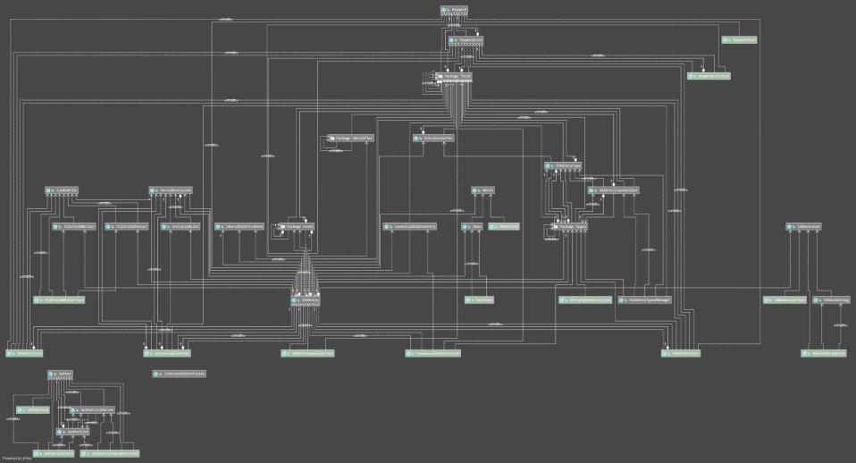



# Übungsaufgaben Woche 3:

## 1. Beziehungen zwischen den Prinzipien

1.1 Wie beeinflussen sich die Prinzipien *Allgemeinheit* und *Voraussehen von Veränderungen*, *Abstraktion* und *exaktes Vorgehen*? Zeichnen Sie ein Diagramm.

1.2 Angenommen Sie könnten in Ihrer Firma nur eines der in der Vorlesung besprochenen Prinzipien durchsetzen. Welches würden Sie wählen? Diskutieren Sie.

## 2. Separieren der Verantwortlichkeiten

2.1 Angenommen Sie müssen einen Sortieralgorithmus implementieren. Was sind mögliche verschiedene Verantwortlichkeiten die Sie trennen könnten?
Beschreiben Sie eine Strategie für die Implementation, die der Trennung der Verantwortlichkeiten Rechnung trägt. 

2.2 Angenommen Sie müssen eine Software zum Verwalten von Referenzen (wie JabRef) implementieren. Was sind mögliche verschiedene Verantwortlichkeiten die Sie trennen könnten?

## 3. Modularisierung

Schauen Sie sich obigen Uses-graphen an. Was können Sie daraus über die Modularisierung von JabRef lernen? 
Welche Module sind besonders wichtig?  Gibt es Dinge, die Ihnen nicht gefallen?

