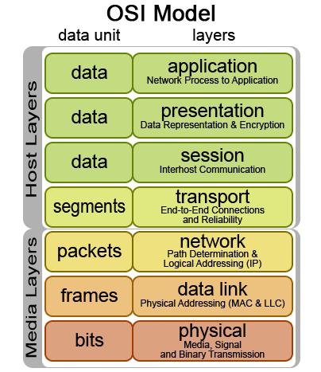



# Einige wichtige Architekturmuster

*Im folgenden werden wir einige wichtige Architekturmuster, also verbreitete Strukturierungen von "uses" Graphen anschauen. Es gibt noch viele weitere verbreitete Architekturmuster.
Das Ziel dieses Artikels ist nicht die Vollständigkeit, sondern Ihnen einen Eindruck zu geben was ein Architekturmuster ist, und wie wir bereits auf dieser Abstrakten Ebene Eigenschaften
eines Systems diskutieren können. 

Das Ziel dieses Artikels ist Ihnen einen Einblick zu geben, 
wie man bereits auf dieser Abstrakten Ebene über Eigenschaften des Systems 

## Layering

Das erste wichtige Muster ist das *Layering*. Hier werden die Module in verschiedene Ebenen eingeteilt. 
Die Kommunikation zwischen den Modulen findet nur zwischen den Ebenen, und immer nur mit der nächst tieferen Ebene statt. 
Das klassische Beispiel ist die sogenannte 3-Tier Architektur. Hier gibt es die folgenden 3 Ebenen:

1. Die Präsentationsschicht. Die Präsentationsschicht entspricht typischweise der Benutzerschnittstelle. Hier wird die Information für den Benutzer aufbearbeitet. Diese Schicht enthält keine Anwendungslogik.
2. Die Anwendungslogik. Module auf dieser Ebene sind für die Anwendungslogik/Businesslogik zuständig. Diese Schicht ist komplett unabhängig von der Darstellung. 
3. Die Datenhaltungsschicht: Module auf dieser Ebene kümmern sich um die Repräsentation der Daten und deren Persistenz. Typischwerweise kümmert sich diese Schicht auch um die Datenbankanbindung und kapselt technische Details der Datenhaltung.
			


Bei dieser Architektur werden Zyklen im Graphen komplett vermieden. Auch ist es relativ einfach eine der Schichten auszutauschen. Wenn Beispielsweise eine neue graphische Benutzeroberfläche entwickelt wird, müssen nur die Module in der Präsentationsschicht angepasst werden. 
Auch die wiederverwendbarkeit von Komponenten ist hoch. So kann zum Beispiel ein Modul für die Datenhaltung aus verschiedenen Anwendungen angesprochen werden. 

<!-- Ein weiteres klassisches Beispiel, diesmal aus dem Netzwerkbereich, ist das ISO/OSI Referenzmodell. 



Es teilt die Kommunkation in verschiedene Ebenen ein. Auf der Ebenen 0 haben wir den Physical Layer. Die Aufgabe dieser Ebene ist 
das  -->

## Pipelines

Die nächste wichtige Architekturvariante ist die Pipeline. Bei der Pipeline wird jedes Modul nur von jeweils einem Vorgängermodul benutzt. Das Modul selbst
benutzt auch jeweils nur ein weiteres Modul. Diese Architektur ist sehr einfach zu verstehen und zu warten, da die Abhängigkeiten zwischen den Modulen minimal sind. 


Pipelines sind immer dann die richtige Architekturmethode, wenn Daten Schritt für Schritt bearbeitet und transformiert werden müssen. 
Ein typisches Beispiel ist die Bildverarbeitung. Häufig durchläuft ein Bild eine Sequenz von Bearbeitungsschritten. Zum Beispiel wird in einem ersten Schritt das Bild geglättet, dann werden Kanten extrahiert, und am Ende werden nur die wichtigen Kanten herausgefiltert. Jedes Modul nutzt immer nur die Funktionalität des nachfolgenden Moduls.


Pipelines ind auch im Betriebssystem Unix weit verbreitet. 
```
$ cat /etc/passwd | cut -d":" -f1 | grep bart | less 
```
Bei obigem Kommando wird zuerst ein Text durch das Modul ```cat``` dargestellt. Das Modul ```cut``` nimmt diesen Input und schneidet die erste, durch : getrennte Spalte 
ab. Das Modul ```grep``` filtert alle Zeilen raus, die den Teilstring "bart" beinhalten. Schlussendlich zeigt das Modul ```less``` den Output Zeilenweise an. 


## Blackboard
Die letzte Architektur die wir uns anschauen ist das Blackboard. 


Die Idee hier ist, dass wir mehrere Module haben, die alle 
miteinander kommunizieren müssen. Wenn wir nun jedes Modul 
direkt mit jedem anderen kommuniziert, gibt dies sehr viele 
Abhängigkeiten zwischen den Modulen. Einfacher ist es, wenn wir 
eine zentrale Stelle (ein Blackboard) einrichten, über die die Kommunikation läuft. Bei $$n$$ Modulen haben wir dann nicht mehr
$$n^2$$ Abhängigkeiten zwischen den Modulen, sondern nur noch $$2n$$.	
Typische Beispiele für eine solche Architektur sind Börseninformationssysteme oder Auktionssysteme. 
Alle Angebote werden hier an ein zentrales Modul gesendet, welches die Information verwaltet. Die Anfrage kann dann direkt 
an das zentrale Modul gesendet werden.

