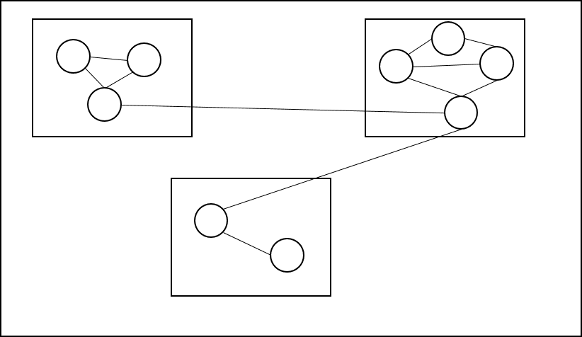
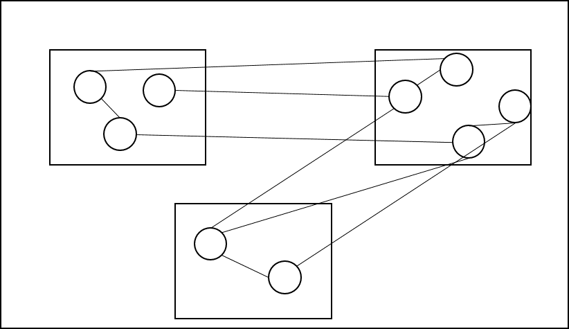
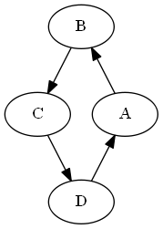
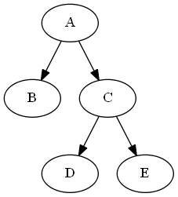
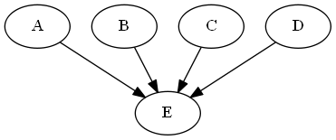



# Einige Merkmale guten Designs

In diesem Artikel werden wir uns einige Merkmale von guten Designs anschauen. Wir müssen gleich zu Beginn anmerken, 
dass uns diese Designmerkmale nur grobe Hinweise geben können. Ohne etwas über die Designziele und die Anwendung zu wissen, ist es nicht möglich, 
ein Design gründlich zu bewerten. Trotzdem bieten diese Merkmale gute Anhaltspunkte um kritische Punkte in einem Design zu identifizieren.

## Kopplung und Bindung

Zwei wichtige Begriffe, die wir nutzen um die Qualität eines Designs zu beurteilen, sind Kopplung und Bindung.

Die Koppelung beschreibt, wie interdependent die Module sind. Wenn wir viele Beziehungen zwischen den Modulen haben, dann ist die Koppelung hoch. Wenn es wenige Beziehungen gibt, dann ist die Koppelung niedrig.
Wir streben in der Regel Designs mit niedriger Koppelung an. Wir sagen auch, dass die Module lose gekoppelt sind. Wenn wir ein Design mit loser Kopplung haben, dann können wir Module einfacher austauschen, ohne dass wir viele andere Module anpassen müssen.

Die Bindung misst, wie eng die Funktionalität innerhalb eines Modules miteinander verbunden sind. Wenn ein Modul eine hohe Bindung hat, bedeutet das, dass sie einen bestimmten, gut definierten Zweck oder eine Aufgabe hat. 
Solche Module sind oft einfacher zu verstehen, zu warten und wiederzuverwenden. Bei einer niedrigen Bindung hat ein Module oft viele unterschiedliche, nicht zusammenhängende Aufgaben. Das kann den Code unübersichtlich und schwerer zu warten machen.

Die Situation ist bildlich in folgender Grafik zusammengefasst:

<figure>

<figcaption align = "center"><b>Links:</b> Die Idealsituation. Lose Kopplung und starke Bindung. <b>Rechts:</b> Ein (problematisches) Design mit starker Kopplung und niedriger Bindung.</figcaption>
</figure>

## Zyklen und Hierarchien

Kopplung und Bindung beziehen sich darauf, wie viele Beziehungen zwischen den Modulen bestehen. 
Was aber auch wichtig ist, ist das Muster der Beziehungen. Hier gibt es zwei Extreme. Einerseits können wir ein Design haben, bei dem ein Zyklus besteht. Wenn wir zum Beispiel 3 Module A, B C und A haben, und A nutzt B, B nutzt C und C nutzt D und D nutzt A, dann haben wir einen Zyklus (siehe Abbildung unten). Zyklen sind problematisch, weil wir die Module nicht isoliert verstehen können. Um zu verstehen was Modul A macht, müssen wir auch Modul C verstehen und um dieses zu verstehen auch Modul B, dazu Modul C und dann wieder Modul A. 

Besser ist es, wenn wir ein Design haben, bei dem die Beziehungen eine Hierarchie bilden (wie der Graph rechts in der Abbildung). Das bedeutet, dass wir Module haben, die keine Abhängigkeiten haben (hier die Module B, D und E). Diese Module können wir isoliert verstehen. Wenn wir dann diese Module verstehen, können wir die nächste Ebene anschauen, und so weiter. Eine Hierarchie ist aber nicht nur einfach zu verstehen, sondern hat auch für das Testen grosse Vorteile. Die Module auf der untersten Ebene können wir isoliert testen. Wenn wir dann die nächste Ebene testen, können wir die Module der untersten Ebene als gegeben annehmen.

<figure>

<figcaption align = "center"><b>Links:</b> Modul E hat einen hohen Fan-in. Es ist eine gute Abstraktion. <b>Rechts:</b> Modul A hat einen hohen Fan-out. Es macht wahrscheinlich zu viel.</figcaption>
</figure>

## Fan-in und Fan-out
 Wir können anhand des Uses Graphen noch mehr ablesen. Wenn wir ein Modul betrachten, können wir uns anschauen, 
wie viele Beziehungen eingehen, und wieviele von dem Modul ausgehen. Wir sprechen von Fan-in und Fan-out. 
Ein hoher Fan-in ist ein Indikator dafür, dass das Modul die angebotene Funktionalität gut abstrahiert, da es ja von vielen unterschiedlichen Modulen benutzt werden kann. 
Ein Hoher Fan-out hingegen ist eher ein schlechtest Zeichen. Es ist ein Zeichen dafür, dass das Modul zu umfangreich ist, also nicht nur eine einzelne Verantwortung übernimmt. Deshalb muss es die Funktionalität von ganz vielen anderen Modulen in Anspruch nehmen. 

<figure>

<figcaption align = "center"><b>Links:</b> Modul E hat einen hohen Fan-in. Es ist eine gute Abstraktion. <b>Rechts:</b> Modul A hat einen hohen Fan-out. Es macht wahrscheinlich zu viel. </figcaption>
</figure>
