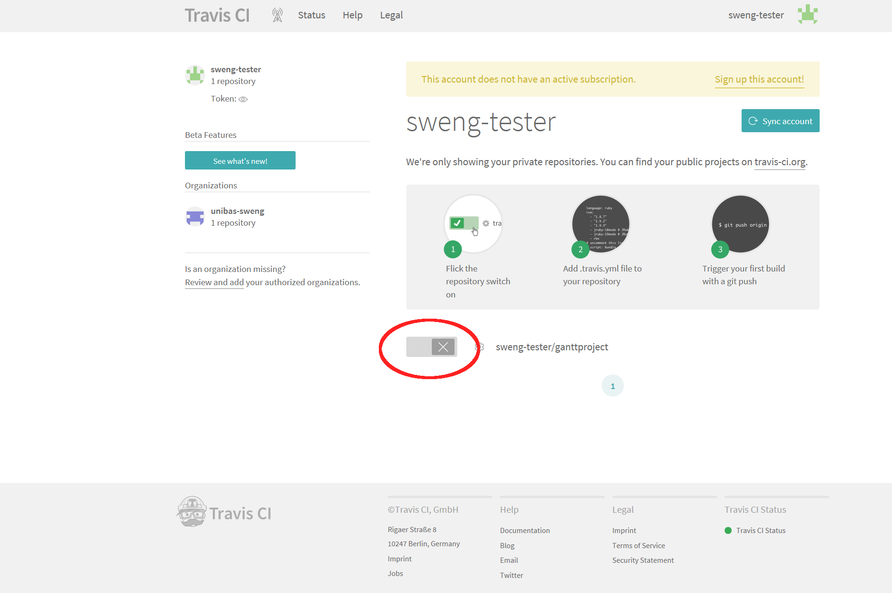

# Übungsblatt 4: Unit Tests und Continuous Integration

* Dieses Übungsblatt sollte bis am 15. Oktober 2019 bearbeitet werden.  
* Abgabe via Pull Request bis spätestens 15. Oktober, 23.59.

#### Bitte haben Sie noch etwas Geduld. Details folgen. 


TODO - irgendetwas mit modulen
TODO - Lesen Sie WIKI (developers howto)
TODO - CIrce CI
TODO - Code coverage


## Einführung

In dieser Übung werden Sie lernen wie Sie ihr Projekt mit [Travis CI](https://www.travis-ci.com) automatisiert testen können und wie man mit Unit Tests arbeitet. 
Neben dem kennenlernen dieser wichtigen Werkzeuge, werden sie bei dieser Übung auch ihr Verständnis vom JabRef Code vertiefen. 


#### 1. Vorbereitung

Da wir die Änderungen der letzten Übung hier nicht benötigen, starten wir wieder vom Master branch. Wir wechseln auf den Masterbranch mit 
```
git checkout master
```

Synchronisieren Sie ihr Repository mit den Änderungen vom *upstream* Repository, wie in [Übung 2](../../week2/exercises/practical-exercises.html) beschrieben  und pushen Sie den aktualisierten master branch auf ihr github repository
```
git push origin master
```


#### Vorbereitung

Wie immer erstellen wir zuerst für unsere Änderungen einen lokalen Featurebranch und wechseln in diesen:

```
git branch uebung4     
git checkout uebung4
```


## Unit Tests

Im Folgenden werden Sie neue Unittests  für verschiedene Klassen in JabRef implementieren. Nehmen Sie als Vorlage die bereits bestehenden Unit Tests in Jabref. 

* Fügen Sie mindestens 2 sinnvolle Tests für die Methode ```BibDatabase.getEntryByKey``` zu der Datei ```BibDatabaseTest``` hinzu. 
* Fügen Sie mindestens 2 sinnvolle Tests für die Methode ```BibDatabase.getReferencedEntry``` zu der Datei ```BibDatabaseTest``` hinzu. 


## Travis CI

*Finden sie heraus was Travis CI ist und wozu es gebraucht wird und beantworten sie folgende Fragen:*

1. Was ist Continuous integration? Wozu setzt man es ein?
2. Was ist Travis?
3. Was macht die Datei .travis.yml, die sie im Wurzelverzeichnis ihres Projekts finden?
4. Was ist eine Buildmatrix?

Schreiben sie ihre Antworten in eine Textdatei Datei die sie ```uebung4.md``` nennen. Die Datei können sie dem Projekt mit
```
git add uebung4.md
```
hinzufügen. 

*Tip: Lösen sie parallel dazu auch die nächste Aufgabe. Dies sollte ihr Verständnis für diesen Service verbessern.*

#### Travis aktivieren

Damit sie Travis auch für ihr Projekt verwenden können, müssen sie dies erst einrichten. Dazu gehen sie auf die die [Webseite](https://www.travis-ci.com) von Travis und melden sich mit ihrem Github Account an. Sie erhalten die Option Travis für eines oder alle Ihrer Github Repositories zu aktivieren. Aktivieren Sie 
```jabref``` und erlauben Sie auch, dass Travis die Github integration vornimmt. 


*Anmerkung: Travis ist ein kommerzieller Service. Sie haben aber 99 Trial runs zur Verfügung. Dies sollte für diesen Kurs reichen. Für Open Source Projekte ist Travis aber gratis nutzbar. Deshalb ist Travis der Standard Service in der Open Source Entwicklung*.

*Anmerkung 2: Wenn Sie sich für das [Github Educational Pack](https://education.github.com/pack) registriert haben, haben Sie gratis builds für private repositories. Falls Ihr Fork public ist, müssen sie auf www.travis-ci.org wechseln. Die beiden Seiten sind identisch und werden von derselben Firma betrieben.*.


Nach erfolgreicher Einrichtung sollten Sie auf eine Seite gelangen die wie folgt aussieht. 



* Probieren sie aus was passiert wenn sie einen Änderung machen (und auf Github pushen), die zu einem Fehlschlagen eines Unittests führt. Was passiert bei Travis? 
* Gehen Sie auf Github und machen Sie einen Pull Request mit diesen fehlerhaften Unittest (Bitte Unit Test auf Ihr den Master branch ihres eigenen Repositories). Was fällt Ihnen auf?
* Korrigieren Sie ihren Fehler wieder und pushen Sie nochmals.


### Abgabe
Die Abgabe der Übung erfolgt durch push vom entsprechenden Branch: 
```
git push origin uebung4
``` 
und entsprechenden Pull Request. Geben Sie bitte das Team ```sweng-assistants-hs19``` als Reviewer an. 
 (Details dazu finden sie in [&Uuml;bungsblatt 2](https://unibas-sweng.github.io/software-engineering/week2/practical-exercises.html)).
 

