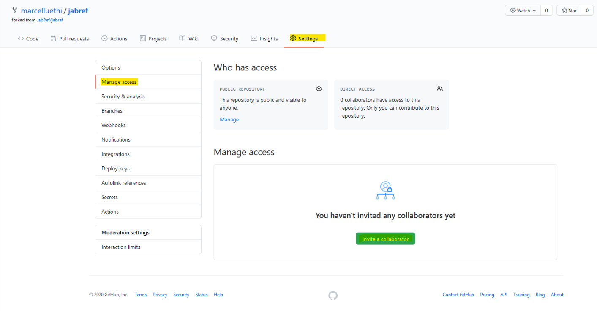
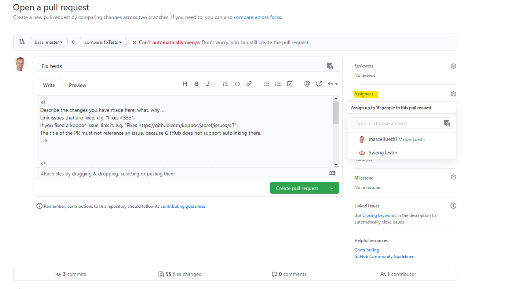

# Übungsblatt 4: Unit Tests und Continuous Integration

* Dieses Übungsblatt muss bis spätestens 19. Oktober, 23.59 bearbeitet und via Pull Request abgegeben werden.
* Wir empfehlen, diese Übungsblatt in Zweiergruppen zu bearbeiten (siehe Abgabeinstruktionen am Ende dieses Dokuments)


## Einführung

In dieser Übung werden Sie lernen wie man mit Unit Tests arbeitet und wie Sie Builds und Tests mittels Continuous Integration pipelines automatisieren können.
Neben dem kennenlernen dieser wichtigen Werkzeuge, werden sie bei dieser Übung auch ihr Verständnis vom JabRef Code vertiefen.


#### 1. Vorbereitung

Da wir die Änderungen der letzten Übung hier nicht benötigen, starten wir wieder vom main Branch. Wir wechseln auf den main Branch mit
```
git checkout main
```

Synchronisieren Sie ihr Repository mit den Änderungen vom *upstream* Repository, wie in [Übung 2](../../week2/exercises/practical-exercises.html) beschrieben  und pushen Sie den aktualisierten main branch auf ihr github repository
```
git push origin main
```


#### Vorbereitung

Wie immer erstellen wir zuerst für unsere Änderungen einen lokalen feature Branch und wechseln in diesen:

```
git branch uebung4
git checkout uebung4
```


## Unittests

Im ersten Teil der Übung werden Sie eigene Unittest für die Klasse *BibDatabase* hinzufügen.  Dabei werden wir

* sehen wie komplexe Software mit Unittests getesten werden kann
* nutzen dass Unittests Beispiele für die korrekte Verwendung der Klassen repräsentieren, und somit auch
als Dokumentation dienen.
* einige zentrale Datenstrukturen von Jabref kennenlernen.

*Anmerkung:* Jabref verfügt über eine hervorragende Testsuite, mit über 5000 Unittests. Auch die Klasse *BibDatabase* ist bereits gut getestet. Unser Ziel ist nicht die Qualität der Tests
oder die Testabdeckung zu verbessern, sondern das System kennenzulernen. Entsprechend sind die von Ihnen zu entwickelnden Unittests nicht ideale Beispiele für gutes Software testing.

*Hinweis:* Wenn Sie mit dem Bibtexformat, welches von Latex benutzt wird um Referenzen zu verwalten noch nicht vertraut sind, finden Sie [hier](http://www.bibtex.org/) alle Informationen.

#### Schreiben eigener Unittests
Schauen Sie sich die Klasse *BibDatabase* und die  vorhandenen Unittests (in der Klasse *BibDatabaseTest*) an. Stellen Sie sicher, dass Sie verstehen, wozu die Klasse im Programm benutzt wird.

Erstellen Sie dann eine eigene Testklasse *MyDatabaseTest* (im selben Verzeichnis wie die Klasse *BibDatabaseTest*).

* Schreiben Sie die Methode ```setUp``` die vor jeder Ausführung eines Unittests ausgeführt werden
soll. In dieser Methode erstellen Sie eine Datenbank mit 3 Einträgen. Die Einträge sollte die untenstehenden Bibtex Einträge repräsentieren. Wie sie Bibtex-Einträge erstellen, sehen Sie in der Klasse ```BibEntryTest```.

```
@book{brooks1987no,
  title={No silver bullet},
  author={Brooks, Frederic},
  year={1987}
}

@inproceedings{parnas1994software,
  title={Software aging},
  author={Parnas, David Lorge},
  booktitle={Proceedings of 16th International Conference on Software Engineering},
  year={1994},
}

@article{liskov1974programming,
  title={Programming with abstract data types},
  author={Liskov, Barbara and Zilles, Stephen},
  journal={ACM Sigplan Notices},
  year={1974},
}
```

* Schreiben Sie dann einen Test ```correctlyCountsNumberOfEntries``` welcher prüft, dass die
  Anzahl Einträge in der Datenbank richtig angegeben werden.
* Schreiben Sie einen Test ```getEntriesSortedOnFieldYear``` welches prüft, ob die Einträge
  mit der Methode ```getEntriesSorted``` korrekt nach Jahr sortiert werden können.
* Schreiben Sie einen Test ```getEntryByCitationKeyFindsEntry``` welcher überprüft ob für einen gegebenen
Schlüssel (Citationkey) der richtige Eintrag zurückgegeben wird. (Der CitationKey ist der Eintrag auf der ersten Zeile nach dem Eintragstyp, also z.b. *liskov1974programming*).


Die Tests können Sie via der IDE einzeln ausführen, indem Sie auf den grünen Pfeil neben dem Test klicken.
Mit Gradle können Sie Ihre neuen Tests einzeln ausführen, indem Sie ```gradlew test --tests org.jabref.model.database.MyDatabaseTest``` aufrufen.

Wenn Sie alle Tests erfolgreich geschrieben haben, fügen Sie die neue Datei (mit *git add*) dem Repository hinzu und committen Ihre Änderungen.

<!--
* Fügen Sie mindestens 2 sinnvolle Tests für die Methode ```BibDatabase.getEntryByKey``` zu der Datei ```BibDatabaseTest``` hinzu.
* Fügen Sie mindestens 2 sinnvolle Tests für die Methode ```BibDatabase.getReferencedEntry``` zu der Datei ```BibDatabaseTest``` hinzu.

public class GroupTreeNode extends TreeNode<GroupTreeNode>
package org.jabref.model.groups;
Jabref preferencefilter
package org.jabref.model.ChainNode

package org.jabref.logic.citationstyle.discoverCitationStyles
-->


## Github Actions

In diesem Teil der Übung lernen Sie Github Actions kennen. Lesen Sie [hier](https://github.com/features/actions) was Github Actions sind und wie man diese für Java konfiguriert.

Jabref nutzt eigentlich Github Actions. Wir habe die entsprechenden Konfigurationsdateien für unsere Übungen jedoch entfernt.
Schauen Sie sich im [offiziellen JabRef Repository](https://github.com/JabRef/jabref) auf Github an wie Github Actions benutzt werden. Finden Sie heraus, welche Teile der Konfigurationsdateien Sie brauchen um die Unittests bei jedem Push auf Github automatisch ausführen zu können. Aktivieren Sie diese Funktion für ihr Projekt. Die Tests sollen nur ausgeführt werden, wenn Sie den Branch *uebung4* auf Github pushen.

*Hinweis: Bei der von uns verwendeten JabRef Version laufen nicht alle Tests fehlerfrei durch. Sie müssen also nichts unternehmen wenn Sie sehen, dass einige Tests fehlschlagen.*

### Abgabe
Die Abgabe der Übung erfolgt durch push vom Übungs-Branch:
```
git push origin uebung4
```
und entsprechenden Pull Request. Als Reviewers geben Sie ```emugdan```, ```colinhex``` und ```guenesaydin``` an.
(Details dazu finden sie in [&Uuml;bungsblatt 2](/../../week2/exercises/practical-exercises)).

Wenn Sie die Übung zu zweit bearbeitet hat, soll nur eine Person der Gruppe einen pull-request machen.
Die andere Person soll als *Collaborator* zum Projekt hinzugefügt, und dann als *Assignee* ausgewählt werden
(siehe Screenshots)




