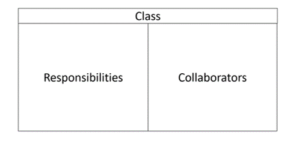

# Designheuristiken

In diesem Artikel schauen wir uns eine einfache Designheuristik an, die zum Erstellen objektorientierter Designs verwendet werden kann.
Es ist aber wichtig, dass wir gleich zu Beginn festzuhalten, dass es keine Patentlösung für Software-Design gibt. 
Die hier vorgestellten Designheuristiken sind daher lediglich Leitfäden, die als Startpunkt für die Erstellung eines gelungenen Designs dienen können.

### Allgemeines zum Designprozess

Design ist vor allem ein kreativer Prozess, der mehr ist als das blosse Zusammensetzen von Codebausteinen. Es geht darum, ein System so in Teile aufzuteilen dass das System effizient, wartbar und erweiterbar ist.
Oft ist es aber so, dass wir einen Kompromiss zwischen diesen Zielen eingehen müssen. Mehr noch: Was für einen Anwendungsfall im Kontext des gesamten Systems ideal sein kann, kann für einen zweiten Anwendungsfall suboptimal sein kann. 
Dies zeigt schon, dass gutes Design viel Erfahrung und ein tieferes Verständnis des zu gestaltenden Systems verlangt. Es ist wichtig, sich praktisch mit dem System auseinanderzusetzen und zu verstehen, wie es funktioniert und wie es verwendet wird.
Daraus folgt auch gleich, dass Design ein iterativer Prozess ist. Wir werden in der Regel nicht auf Anhieb ein perfektes Design finden, sondern müssen es schrittweise verbessern.

### Leitfragen in OO-Designprozess

Obwohl es kein Rezept für gutes Design gibt, gibt es doch einige Leitfragen, die uns helfen können, ein Design zu verbessern.

Wenn man mit dem objektorientierten Design beginnt, gibt es einige Schlüsselfragen, die man als Erstes beantwortet werden sollten:

* Was sind die möglichen Klassen und Objekte im System?
* Welche Verantwortlichkeiten sollte jede Klasse haben?
* Welche anderen Klassen sind notwendig, um die jeweilige Aufgabe einer Klasse zu erfüllen?

#### Klassen finden 
Eine einfache Heuristik für die Identifikation von Klassen ist die sogenannte "Noun-Method", bei der Substantive in den Anforderungen potenzielle Klassen und Verben potenzielle Methoden sind. 
Aber Achtung: Diese Methode ist recht rudimentär und sollte nicht dogmatisch angewendet werden.

#### Verantwortlichkeiten einer Klasse 

Jede Klasse sollte idealerweise nur eine Verantwortung haben (Prinzip: Separation of Concerns). Das heisst, um eine Funktionalität zu erfüllen, müssen die Klasse zusammenarbeiten. 
Wenn einmal die Verantwortlichkeiten jeder Klasse gut definiert sind, dann lassen sich die Klassen, mit der eine Klasse zusammenarbeiten muss, relativ leicht identifizieren. 

### CRC Karten

Ein einfaches Werkzeug um die Zusammenarbeit zwischen Klassen zu identifizieren sind CRC Karten. CRC steht für Class-Responsibility-Collaboration.

CRC-Karten (Class-Responsibility-Collaboration) können in diesem Kontext eine hilfreiche Designunterstützung bieten.

Diese Karten, welche häufig auf Karteikarten geschrieben werden, enthalten folgende Informationen:	

* Was sind mögliche Klassen/Objekte?
* Welche Verantwortung übernimmt eine Klasse (separations of Concern)?
* Mit welcher Klasse muss eine Klasse zusammenarbeiten um die Aufgabe zu erfüllen?

Die Karten werden dann so angeordnet, so dass die Zusammenarbeit zwischen den Klassen ersichtlich wird. Die Karten helfen dabei, die Verantwortlichkeiten der einzelnen Klassen zu identifizieren und die Zusammenarbeit zwischen den Klassen zu verstehen.
Die Klassen können dann in einem nächsten Schritt in einem Klassendiagramm modelliert werden.

### Einige Designtipps

* Der Fokus sollte auf den Konzepten und nicht nur auf den Softwareklassen oder Daten liegen.
* Beginnen Sie mit einem Teilmodell und versuchen Sie nicht, das gesamte Problem auf einmal zu lösen.
* Das System sollte inkrementell ausgebaut und verbessert werden. 
* Versuchen Sie, die Verantwortlichkeiten so zu verteilen, dass jede Klasse eine klare und eindeutige Rolle hat. Dies hat direkte Auswirkung auf die Kohäsion. 
* Versuchen Sie die Kopplung zu reduzieren: Wenn es zu viele Abhängigkeiten gibt, haben Sie vielleicht ein wichtiges Konzept noch nicht modelliert?
