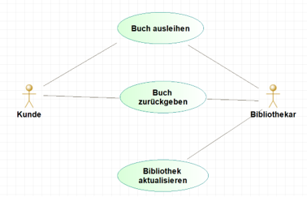

# Anforderungen ermitteln mit Use-Cases

Wir haben gesehen, dass die Anforderungen ein wichtiger Schritt in der Entwicklung eines Softwaresystems sind. Jedoch haben wir bisher wenig 
konkrete Werkzeuge gelernt, wie man Anforderungen ermittelt. 
Ein wichtiges Mittel zum identifizieren von funktionalen Anforderungen ist die Verwendung von Use-Cases. Use-cases wurden ursprünglich in der
Objektorientierten Analyse und Design eingeführt. Sie können aber auch in anderen Kontexten verwendet werden. Ein verwandtes Konzept sind die
User Stories, die in der agilen Softwareentwicklung verwendet werden. Wir werden uns in diesem Kurs auf Use-Cases konzentrieren.

Die Idee hinter Use-Cases ist, dass wir uns in die Rolle eines Benutzers versetzen und uns überlegen, wie dieser Benutzer mit dem System interagiert.
Für jede Interaktion schreiben wir dann einen Use-Case. Ein Use-Case ist also eine textuelle Beschreibung einer Interaktion zwischen einem Benutzer und dem System.
Dieses Vorgehen hat den Vorteil, dass wir uns auf die Funktionalität des Systems konzentrieren und nicht auf die technische Umsetzung. Zudem hilft uns die genaue Dokumentation einer 
Benutzerinteraktion Dinge zu entdecken, die wir sonst vielleicht vergessen hätten.


### Einen Use-Case erstellen


Ein Use-Case-Dokument folgt meist einem bestimmten Template, das verschiedene Abschnitte zur genauen Beschreibung der Anforderungen und Aktionen enthält. 
Ein Template kann wie folgt aussehen:
```
Name: Name des use cases
Akteure: Akteur 1, Akteur 
Vorbedingung:
Nachbedingung (Erfolg):
Nachbedingung (Fehler):

Standardablauf:
Schritt 1
Schritt 2
```

Wir werden die einzelnen Abschnitte im Folgenden genauer betrachten.

##### Name

Der Name sollte den Use-Case kurz und präzise beschreiben. Ein gut gewählter Name erleichtert die Kommunikation und stellt sicher, dass alle Stakeholder eine gemeinsame Vorstellung von der Funktion des Use-Cases haben.

##### Akteure

Die Akteure sind die Entitäten, die mit dem System interagieren. Sie können Menschen, andere Systeme oder sogar andere Teile des Systems selbst sein. Der Abschnitt "Akteure" definiert, wer oder was an diesem speziellen Use-Case teilnimmt.


##### Vorbedingung

Vorbedingungen sind die Bedingungen oder Zustände, die erfüllt sein müssen, bevor der Use-Case ausgeführt werden kann. Dies könnte zum Beispiel der Zugriff auf eine bestimmte Ressource sein oder dass der Benutzer angemeldet sein muss.

##### Nachbedingung (Erfolg)

Nachbedingungen beschreiben den Zustand des Systems nach erfolgreicher Ausführung des Use-Cases. Diese Klarstellung hilft zu verstehen, welche Änderungen im System vorgenommen wurden und welche Ziele erreicht wurden.

##### Nachbedingung (Fehler)

Dieser Abschnitt legt fest, was passiert, wenn der Use-Case fehlschlägt. Das kann eine Fehlermeldung sein oder ein Rollback auf einen vorherigen Zustand des Systems. Das Dokumentieren dieser Bedingung ist wichtig für die robuste Gestaltung des Systems.

##### Standardablauf

Der Standardablauf beschreibt die Sequenz der Ereignisse oder Schritte, die im Rahmen dieses Use-Cases auftreten. Er wird oft als nummerierte Liste dargestellt und sollte so detailliert wie nötig sein, um Missverständnisse zu vermeiden.

    Schritt 1, Schritt 2, ...: Jeder Schritt sollte klar beschreiben, welche Aktionen der Akteur und das System ausführen. Dabei ist es hilfreich, sowohl die Aktionen der Akteure als auch die Reaktionen des Systems zu dokumentieren.

Die Struktur und der Detailgrad eines Use-Cases können variieren, abhängig von der Komplexität des Systems und den Anforderungen der Stakeholder. Aber diese Grundelemente bilden die Basis für die meisten Use-Case-Dokumente und helfen dabei, klare und verständliche Anforderungen zu formulieren.

### Beispiel: Buch ausleihen

Das folgende Beispiel zeigt einen Use-Case für eine Bibliotheksanwendung. Der Use-Case beschreibt, wie ein Kunde ein Buch ausleihen kann.

```
Name: Buch ausleihen 
Akteure: Bibliothekar, Kunde 
Vorbedingung: Buch ist verfügbar
Nachbedingung (Erfolg): Ausleihe im System vermerkt
Nachbedingung (Fehler): - 
Standardablauf:
Kunde gibt Bibliothekar seine Karte
Bibliothekar prüft Karte und schaut sich getätige Vorbestellung an
Bibliothekar holt alle bestellten Bücher
Bibliothekar vermerkt im System das Bücher vom Kunden ausgeliehen sind.
```


### Use-case Diagramme

Die UML stellt ein Diagramm zur Verfügung, um die Beziehungen zwischen Use-Cases zu visualisieren. Ein Use-Case-Diagramm zeigt die Beziehungen zwischen Akteuren und den Use-Cases. Es zeigt auch, wer mit wem kommuniziert.
In unserer Bibliotheksanwendung könnte das Use-Case-Diagramm wie folgt aussehen:



Als Akteure haben wir den Bibliothekar und den Kunden. Der Bibliothekar kann Bücher ausleihen und zurückgeben und die Bibliothek aktualisieren. 
Der Kunde kann Bücher ausleihen und zurückgeben. Wir sehen auch, dass bei der Ausleihe und Rückgabe von Büchern sowohl der Bibliothekar als auch der Kunde mit dem System kommunizieren.
Die Aktualisierung wird nur vom Bibliothekar durchgeführt.


Diese Diagramme können hilfreich sein, um die Beziehungen zwischen den Akteuren und den Use-Cases zu visualisieren. Das wichtige an Use-Cases ist jedoch die textuelle Beschreibung und nicht deren grafische Darstellung.