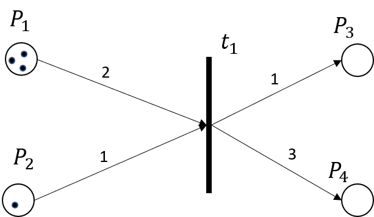
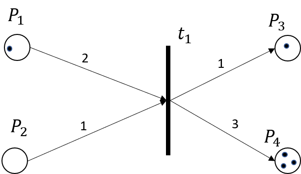
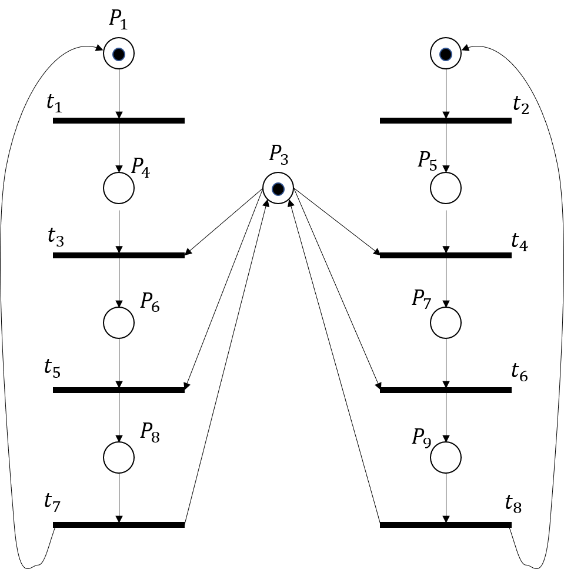
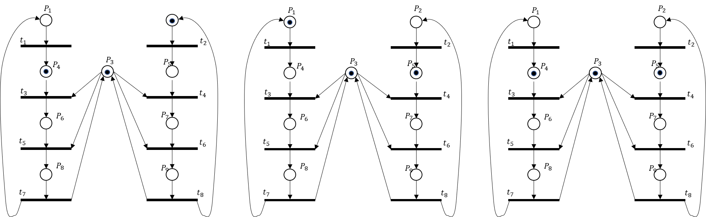
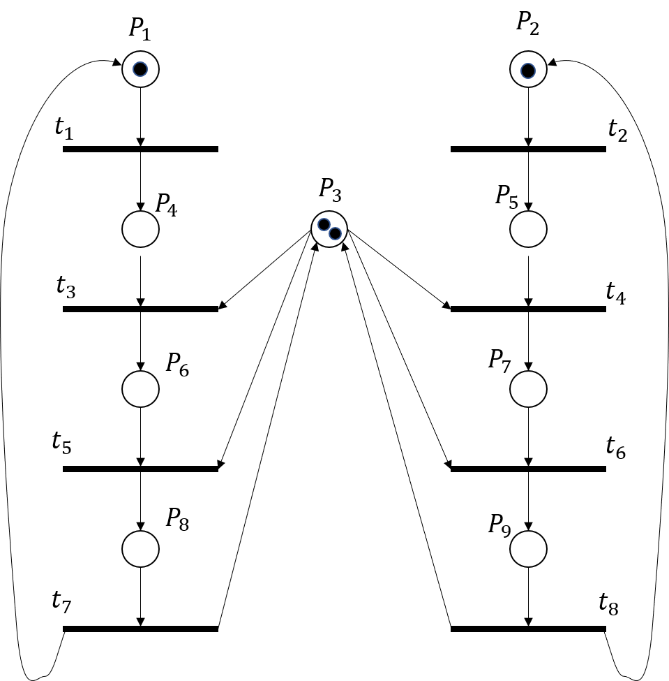


# Petri-Netze

*Petri-Netze sind wichtige Modelle um nebenläufige, nicht-deterministische Systeme zu spezifizieren. Sie gehören zu der Klasse der konstruktiven Spezifikationen. Wie zum Beispiel Datenfluss oder UML Diagramme, lassen sich Petri-Netze 
graphisch darstellen. Petri-Netze haben aber eine mathematisch exakte Definition und Semantik. Dank klar definierten Semantik und der vielfältigen Einsetzbarkeit diser Spezifikationsmethode, stehen zur Analyse und Verifikation ene Vielzahl von Werkzeugen für die Simulation, und eine gut entwickelte mathematische Theorie zur Verfügung.*

## Formale Definition
Wir beginnen zuerst mit der formalen Definition. Diese wirkt hier noch sehr abstrakt, wird aber klar wenn wir die Netze im nächsten Abschnitt graphisch darstellen.

Ein Petri-Netz ist ein Quadrupel $$(P, T, F, W)$$. Hier ist
* $$P$$ eine (endliche) Menge von Stellen
* $$T$$ eine (endliche) Menge von Transitionen
* $$F \subseteq \{P \times T\} \cup \{T \times P \}$$ eine Flussrelation 
* $$W: F \to \mathbb{N^+}$$ eine Gewichtsfunktion.
* die Anfangsmarkierung $$M : P \to \mathbb{N}$$    

Die Gewichtsfunktion $$W$$ ist eine partielle Funktion. Wenn $$W(f)$$ für einen $$f$$ nicht definiert ist, wird das Gewicht $$1$$ angenommen. 

## Graphische Darstellung

Wir sehen hier die graphische Darstellung für ein Petri-Netz, das wie folgt definiert ist. Im Netz sind vier Stellen $$P_1, \ldots, P_4$$ und eine Transition $$t_1$$ definiert. Die Flussrelation ist $$F = \{(P_1, t_1), (P_2, t_1), (t_1, P_3), (t_1, P_4)\}$$. 
Die Gewichtsfunktion ist entsprechend definiert als
$$W((P_1, t_1))=2, W((P_2,t_1)=1), W((t_1, P_3))=1, W((t_1, P_4))=3$$. Schlussendlich haben wir hier die Anfangsmarkierung 
$$M$$ definiert als $$M(P_1)=3, M(P_2)=1, M(P_3)= 0, M(P_4)=0$$.  

Damit wir verstehen, wie das Netz funktioniert, und was die einzelnen Werte bedeuten, müssen wir uns aber die Dynamik, also die Schaltregeln vom Petri-Netz anschauen. 

## Schaltregeln
Jede Transition kann *schalten*. Bevor wir uns anschauen, unter welchen Umständen eine Transition schaltet, schauen wir uns hier erst einmal an, wie sich das Netz nach dem Schalten von Transition $$t$$ verändert. Dies ist in folgendem Bild dargestellt. 

Wir sehen, dass 2 Markierungen aus $$P_1$$ 
und eine Markierung aus $$P_2$$ entfernt wurde. Die Anzahl entfernter Markierungen entspricht also genau den angegebenen Gewichten $$W$$ in der Flussrelation. Zu den Stellen $$P_3$$ und $$P_4$$ sind hingegen neue Markierungen hinzugekommen. Auch hier sind es genau soviel wie durch die entsprechenden Gewichte definiert wurden. 

Wir können dies nun formal ausdrücken: Wenn die Transition $$t$$ schaltet, wird eine neue Markierung $$M'$$ kreiert:

$$
\begin{align}
                        & \text{$p \in$ Input Stellen$(t)$}: \; M'(p) = M(p) - W((p,t))   \\
                        & \text{$p \in$ Output Stellen$(t)$}: \; M'(p) = M(p) + W((t,p))   \\
                        & \text{$p \in$ Input and Output Stellen$(t)$}: \; M'(p) = M(p) - W((p,t)) + W((t,p))  \\
                        \end{align}
$$
           

## Dynamik

Wir müssen nun noch klären, wann denn eine Transition schaltet. Vielleicht etwas überraschend, wird dies nicht durch das Netz vorgegeben. Petri-Netze sind nicht deterministisch und wann eine Transition schaltet ist zufällig. Jedoch schaltet eine Transition nur, wenn sie *aktiviert* ist. 

Eine Transition ist aktiviert wenn:

$$
                    \forall p \in \text{Input Stellen}(t) : M(p) \ge  W((p,t)) 
$$

In Worten: Die Transition ist aktiviert wenn für alle Input Stellen einer Transition mindestens soviele Markierungen vorhanden sind, wie durch die entsprechende Gewichten auf der Flussreaktion vorgegeben.
In unserem einfachen Beispiel ist Transition $$t_1$$ also aktiviert und kann schalten.
![petri-netz] (../../slides/images/petri-net-simple-initial.png)
                  
Nun schauen wir uns die Dynamik noch an einem etwas komplexeren Beispiel an:

In diesem Beispiel sind die Gewichte nicht explizit angegeben, alle Gewichte sind also 1 gemäss Definition. Wir sehen, dass sowohl Transition $$t_1$$ als auch Transition $$t_2$$ aktiviert sind. Wir haben nun drei mögliche Zustände im nächsten Zeitschritt. 

## Analyse

Um Spezifikation mit Petri-Netzen zu verifizieren können wir diese nun einfach simulieren. Wir können dann beobachten, wie die Dynamik ist, und ob es zu Problemen kommen kann. 
Ein typisches Problem in Nebenläufigen Systemen sind Deadlocks, also Zustände, wo jeder unabhängige Teil durch die jeweils anderen blockiert ist. Ein Petri-Netz, bei dem es zu einem Deadlock kommen kann ist in folgender Abbildung dargestellt:

*Übung: Wie kann es hier zum Deadlock kommen?*

### Komplexeres Beispiel

Als letztes wollen wir uns noch ein konkretes Beispiel anschauen. Wir nehmen dazu wieder unsere Bibliotheksanwendung (Abbildung nach Pfleeger & Atlee, 4.41). In diesem Beispiel sehen wir Transitionen (z.B. Auseihe initiieren) zu denen es keine Inputstellen gibt. Diese sind gemäss Definition dann immer aktiviert, können also immer schalten.

Dieses System modelliert den Prozess von der Ausleihe und Rückgabe eines Buchs in ein System. Die Spezifikation stellt sicher, dass jedes Buch nur einmal ausgeliehen wird. 
Schauen Sie sich das Beispiel genau an, und stellen Sie sicher, dass Sie verstehen, weshalb jedes Buch nur genau einmal ausgeliehen werden kann.
Mit solchen Situationen sind wir in der Softwareentwicklung immer konfrontiert, wenn ein  Softwaressytem nur eine endliche Anzahl Ressourcen zur Verfügung hat, aber mehrere Prozesse darauf zugreifen müssen. 