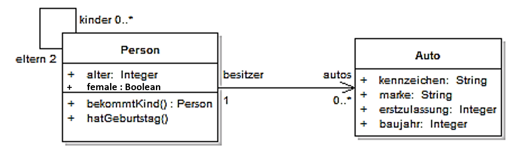



# Logische Spezifikationen mit der Objekt Constraint Language (OCL)

In der letzten Woche haben wir gesehen, wie wir mithilfe von logischen Ausdrücken Vor- und Nachbedingungen sowie Invarianten, Eigenschaften von Modulen spezifizieren können.
Obwohl wir solche formalen Spezifikationen nicht routinemässig für jedes Modul einsetzen, sind sie doch ein wichtiges Werkzeug, um die Spezifikationen zu präzisieren und zu verifizieren.
Entsprechend bietet auch die UML eine Möglichkeit, solche Spezifikationen zu erstellen, nämlich die *Object Constraint Language* (OCL). In diesem Artikel wollen wir uns die wichtigsten Aspekte der OCL anhand von einem Beispiel ansehen, ohne
jedoch ins Detail zu gehen. OCL selbst ist eine relativ komplexe Sprache, die wir hier nicht im Detail behandeln können. 

(Das Nachfolgende Beispiel ist dem [Wikipedia Eintrag zum Thema OCL](https://de.wikipedia.org/wiki/Object_Constraint_Language) entnommen)

### Das Klassendiagramm

Der Startpunkt unserer Spezifikation ist ein Klassendiagramm. 



Wenn Sie sich dieses Klassendiagramm ansehen, erhalten Sie bereits eine gute Vorstellung davon, wie die Klasse `Person` spezifiziert ist und wie die Beziehung zur Klasse `Auto` aussieht. Zum Beispiel können wir ablesen, dass eine Person mehrere Kinder haben kann, und selbst jeweils genau 2 Eltern hat. Eine Person kann ein oder mehrere Autos besitzen, und ein Auto gehört genau einer Person.
Es gibt aber auch einige Dinge, die nicht explizit spezifiziert sind. Beispielsweise wissen wir zwar, dass das alter einer Person eine Ganzzahl sein muss, es ist aber nirgends spezifiziert, dass das Alter einer Person positiv sein muss. Die Spezifikation würde auch zulassen, dass die Eltern jünger als die Kinder sind, oder dass eine Person, die erst 5 Jahre alt ist ein Auto besitzt. Genau solche Dinge können wir mit OCL spezifizieren und damit die Spezifikation präzisieren.

### Spezifikation mit OCL

Die OCL sieht drei Arten von Ausdrücken vor, nämlich *Invariante*, *Vorbedingungen* und *Nachbedingungen*. Wir beginnen mit den Invarianten. 

#### Invarianten

Am besten wir starten gleich mit einem Beispiel, welches Sie sicher mühelos verstehen können:

```ocl
context Person inv: self.alter >=0
```

Um eine Invariante zu spezifizieren, schreiben wir das Schlüsselwort `context` sowie den Klassennamen, um anzugeben, auf welche Klasse sich die Invariante bezieht.  Das Schlüsselwort `inv` nach dem Klassennamen gibt an, dass es sich um eine Invariante handelt. Die Invariante selbst ist ein logischer Ausdruck, der für alle Instanzen der Klasse gelten muss. In diesem Fall besagt die Invariante, dass das Alter einer Person immer grösser oder gleich 0 sein muss. Das reservierte Wort `self` bezieht sich auf die Instanz (also das Objekt), für die die Invariante gilt. Es entpricht der `this` Referenz in Java.

Nun schauen wir uns ein etwas komplexeres Beispiel an. Wir wollen ausdrücken, dass eine Person jünger ist als ihre Eltern. Dies erreichen wir mit folgendem Ausdruck:

```ocl 
context Person inv: self.eltern->forAll(e|e.alter>self.alter)
```
Der Ausdruck `self.eltern` gibt uns eine Collection von Objekten vom Typ `Person`. Die Pfeilnotation `->` ist eine *Navigationsnotation*, die uns erlaubt, auf die Attribute und Methoden der Objekte in der Collection zuzugreifen. Die Funktion `forAll` wendet die Funktion, die nach dem `|` Zeichen steht auf alle Elemente der Collection an. In diesem Fall ist die Funktion `e|e.alter>self.alter`. Diese Funktion gibt `true` zurück, wenn das Alter des Elements `e` grösser ist als das Alter der Person, für die die Invariante gilt. Die Invariante ist also erfüllt, wenn alle Eltern älter sind als die Person selbst.

Die Nachfolgenden zwei Ausdrücke sollten Sie nun selbst verstehen können. 

```ocl
context Person inv: self.alter<18 implies self.autos->isEmpty()
context Person inv: Person.allInstances()->exists(p | p.autos->size() > 0)
```

Der erste Ausdruck sagt, dass eine Person, die jünger als 18 ist, keine Autos besitzen darf. Der zweite Ausdruck sagt, dass es mindestens eine Person geben muss, die ein Auto besitzt.

#### Vor- und Nachbedingungen

Wenn wir eine Methode spezifizieren, können wir auch Vor- und Nachbedingungen angeben. Die Vorbedingungen geben an, welche Bedingungen vor dem Aufruf der Methode gelten müssen, damit die Methode aufgerufen werden kann. Die Nachbedingungen geben an, welche Bedingungen nach dem Aufruf der Methode gelten müssen.

Auch dies lässt sich am besten anhand eines Beispiels illustrieren:

```ocl 
context Person::bekommtKind() 
    pre: self.female = true
    post: self.kinder->notEmpty() and self.kinder->size() > self.kinder@pre->size()
context Person::bekommtKind() post: self.kinder->notEmpty() and self.kinder->size() > self.kinder@pre->size()
```
Die Vorbedingung `self.female = true` besagt, dass nur Frauen Kinder bekommen können. Die Nachbedingung `self.kinder->notEmpty() and self.kinder->size() > self.kinder@pre->size()` gibt an, dass die Person nach dem Aufruf der Methode mindestens ein Kind haben muss, und dass die Anzahl Kinder grösser sein muss als vor dem Aufruf der Methode.

### Schlussbemerkung

Wenn Sie diesen Beispiel aufmerksam gefolgt sind, sollten Sie das Beispieldiagramm nun besser verstehen. Vielleicht sind Ihnen sogar Ungereimtheiten aufgefallen? Sollte die Methode `bekommtKind` wirklich nur von Frauen aufgerufen werden können? Bezieht sich das Kind bekommen auf die Person selbst, oder auf die Person und ihren Partner? Solche Fragen können Sie sich aber nur stellen, da Sie nun eine präzise Spezifikation haben dank derer Ihnen solche Feinheiten überhaupt auffallen. 