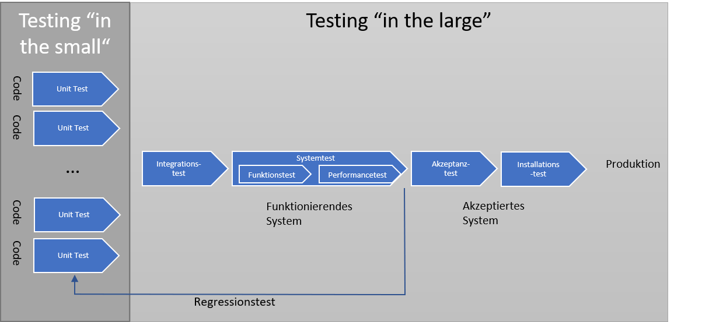
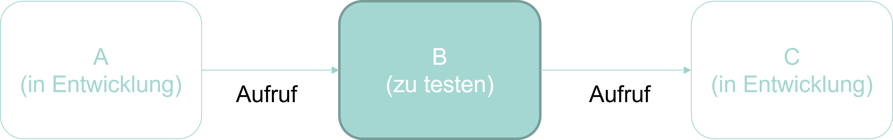



# Testen im Grossen

Beim Testen eines Softwareprodukts unterscheiden wir zwischen dem Testen im Kleinen und dem Testen im Grossen.
Das Testen im Kleinen ist das Testen einzelner Module. Dies wird typischerweise von den Entwickler*innen durchgeführt.

Nur die einzelnen Module zu testen ist aber nicht ausreichend. Wir müssen auch das Zusammenspiel der Module testen. Dies ist das Testen im Grossen. Es gibt verschiedene Arten von Tests, die wir im Grossen durchführen können. Die wichtigsten sehen Sie in der nachfolgenden Abbildung.

# Integrationstest

Der erste Test, den wir durchführen, ist der Integrationstest. Beim Integrationstest testen wir, wie die einzelnen Module zusammenarbeiten. Wir testen also, ob die Schnittstellen zwischen den Modulen korrekt sind. Während der Wartung einer Software ist der Integrationstest einfach durchzuführen. Die Sofware ist bereits implementiert und wenn wir ein Modul testen, können wir dies im Kontext der gesamten Software testen. Schwieriger ist es bei der Entwicklung. Es ist während der Entwicklung nicht immer möglich, ein neu entwickeltes Modul im gewünschten Kontext zu testen, da die anderen Module die mit diesem Modul zusammenarbeiten sollen vielleicht auch noch nicht implementiert sind. Betrachten Sie zum Beispiel den folgenden Modulgraphen.

Wenn wir das Modul $M_{1,2,2}$ im Zusammenhang testen wollen, müssen die Module $M_{1,2}, M_{1,3}$ und $M_2$ bereits vorhanden sein. 
Falls dies nicht der Fall ist, dann müssen wir uns für den Integratiosntest mit Hilfskonstrukten behelfen. Wir entwickeln sogenannte Stubs und Driver, die die fehlenden Module ersetzen. Ein Stub ist ein Modul, das die Schnittstelle eines anderen Moduls implementiert, aber keine Funktionalität hat. Ein Driver ist ein Modul, das die Schnittstelle eines anderen Moduls implementiert, aber die Funktionalität des anderen Moduls hat. Die Situation ist in der nachfolgenden Abbildung dargestellt.

Sie sehen übrigens auch hier wieder einen Vorteil von loser Kopplung. Wenn ein Modul stark gekoppelt ist, dann müssen wir für den Integrationstest viele Stubs und Drivers entwickeln. Wenn die Module lose gekoppelt sind, dann müssen wir nur wenige Stubs und Drivers entwickeln.

### Bottom-up vs Top-down Integration

Wenn wir die Module integrieren, dann können wir dies auf zwei verschiedene Arten tun. Wir können von unten nach oben integrieren (Bottom-up) oder von oben nach unten (Top-down). Beim Bottom-up Ansatz integrieren wir die Module, die keine Abhängigkeiten zu anderen Modulen haben zuerst. Danach integrieren wir die Module, die von den bereits integrierten Modulen abhängen. Dieses Vorgehen lässt sich besonders gut durchführen, wenn der Modulgraph eine Hierarchie bildet. Beim Top-down Ansatz integrieren wir zuerst die Module, die von anderen Modulen abhängen und danach die Module, von denen andere Module abhängen. Beim Bottom-up Ansatz müssen wir also vor allem Stubs entwickeln, beim Top-down Ansatz vor allem Drivers. Welcher Ansatz besser ist, hängt von der konkreten Situation ab. Bei genügend grossen Projekten ist es oft sinnvoll, beide Ansätze zu kombinieren.

# Systemtest

Die nächste Stufe des Testens ist der Systemtest. Beim Systemtest testen wir, ob das System die Anforderungen erfüllt. Wir testen die  spezifizierten funktionalen und nicht-funktionalen Anforderungen im Pflichtenheft. Der Systemtest wird oft von einer unabhängigen Stelle durchgeführt. In grösseren Firmen gibt es dafür meist eine eigene Testabteilung. Beim Systemtest sollte die Umgebung, in der das System später eingesetzt werden soll, möglichst genau nachgebildet werden, damit nicht durch die unterschiedliche Umgebungen Fehler im Systemtest übersehen werden, die dann später auf dem Produktivsystem auftreten.

# Abnahmetest oder Akzeptanztest

Nachdem der Systemtest erfolgreich durchgeführt wurde, wird das System dem Kunden übergeben. Der Kunde führt dann den Abnahmetest oder Akzeptanztest durch. Dabei testet der Kunde, ob das System die Anforderungen erfüllt. Auch hier ist es hilfreich, wenn wir bereits im Pflichtenheft Abnahmekriterien spezifiziert haben. Diese können wir dann als Grundlage für den Abnahmetest verwenden.

# Installationstest

Falls eine Software auf vielen verschiedenen Systemen installiert werden kann, dann ist es sinnvoll, auch einen Installationstest durchzuführen. Dabei wird die Software auf verschiedenen Systemen installiert und getestet, ob die Installation korrekt durchgeführt wurde.
Dieser kann auch durch den Kunden durchgeführt werden. In diesem Schritt kann auch gleich die Dokumentation getestet werden.

